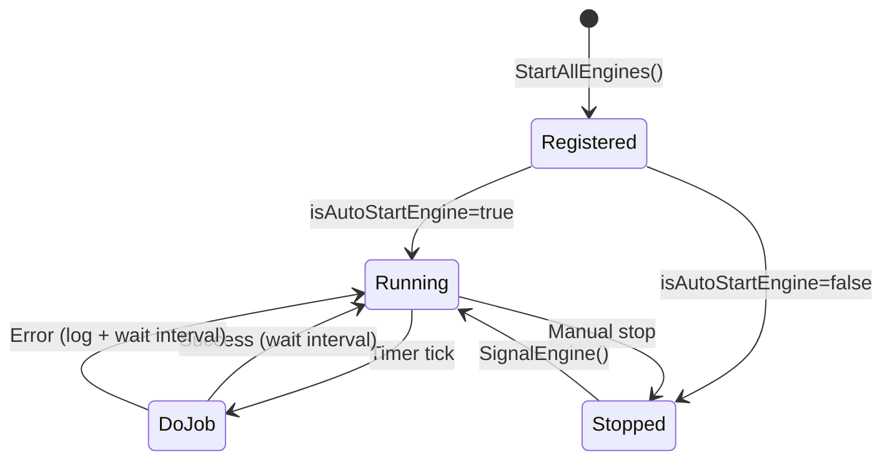

# Background Engines — AllianceMiddleman

## Mục lục
- [Tổng quan](#tổng-quan)
- [Pattern chung](#pattern-chung)
- [Engines — Order & Payment](#engines--order--payment)
- [Engines — Financial & Withdrawal](#engines--financial--withdrawal)
- [Engines — Notification](#engines--notification)
- [Engines — Data & File Management](#engines--data--file-management)
- [Engines — Calculation & Sync](#engines--calculation--sync)
- [Batch Jobs](#batch-jobs)
- [Hosted Services](#hosted-services)
- [Đăng ký trong Startup.cs](#đăng-ký-trong-startupcs)

---

## Tổng quan

Background engines là các `IHostedService` / `BackgroundService` chạy song song trong cùng process với Web API. Chúng xử lý các tác vụ bất đồng bộ không cần trả kết quả ngay cho client, giúp API response nhanh và không block.

**Tổng số:** 29 engines + 9 batch jobs + 2 hosted services = **40 background workers**

**Vị trí source:**
```
AllianceMiddlemanWebAPI.Service/
├── Engines/              ← 29 engines chính
│   ├── BatchJobs/        ← 9 batch jobs (scheduled)
│   └── EngineHelper.cs   ← Shared utilities
└── Services/
    └── NotificationService.cs  ← Hosted service
```

---

## Engine Quick Reference

| # | Engine | Category | Trigger | Key Entity/SP |
|---|--------|----------|---------|---------------|
| 1 | AutoApprovedOrder_PaymentEngine | Order | Timer | Order (pending payment) |
| 2 | AutoCompleteOrderEngine | Order | Timer | `sp_Get_OrderOverTimeButDontEnd_Json` |
| 3 | CancelBookingEngine | Order | Timer | Order (OWNER2CONFIRM/CUS2DEPOSIT) |
| 4 | OrderCompletionNotifierEngine | Order | Timer | Order (INTHETRIP, 3h before end) |
| 5 | TransferMoneyEngine | Financial | Queue | WithdrawalHistory, AutoWithdrawQueue |
| 6 | TransferPointEngine | Financial | Queue | CoinReward_Process |
| 7 | AutoWithdrawEngine | Financial | Timer | AutoWithdrawQueue → MB Bank API |
| 8 | AutoUpdateWithdrawStatus_MBBankEngine | Financial | Timer | Log_EWallet_MBBank |
| 9 | DoTransferWithdrawFeeEngine | Financial | Queue | Transaction fee processing |
| 10 | AutoExportBillEngine | Financial | Timer | Log_MISAInvoice_PublishHSM |
| 11 | AutoMappingSMS_CompanyBankAccountActivityEngine | Financial | Timer | SMS_CompanyBankAccountActivity |
| 12 | NotificationBatchJobEngine | Notification | Timer | ProactiveNotification |
| 13 | PushNotificationEngine | Notification | Queue | `sp_GetNotifyMessage4Push_Json` |
| 14 | ProactiveNotificationHasNewUser | Notification | Event | ProactiveNotificationDetail |
| 15 | NotifyOrderBeforeDepartureEngine | Notification | Timer | Order (before pickup) |
| 16 | NotificationOrderUnhidePhoneNumberEngine | Notification | Timer | `sp_GetOrdersNeedUnhidePhone_Json` |
| 17 | AutoCompressServiceItemImageEngine | Data | Queue | ImageCompressionQueue |
| 18 | ImageCompressionEngine | Data | Queue | ImageCompressionQueue |
| 19 | DeleteDraftFileEngine | Data | Daily | FileWillBeDownload |
| 20 | DeleteUserDeviceNotActiveEngine | Data | Timer | UserDevice (14d inactive) |
| 21 | UpdateSlugEngine | Data | Timer | URL slug generation |
| 22 | UpdateBlogViewCountEngine | Data | Queue | Blog view count batch |
| 23 | UpdateRentalServiceItem_Calculating_RentCarEngine | Calc | Timer | RentalServiceItem_Calculating |
| 24 | User_Calculating_RentCarEngine | Calc | Timer | User_Calculating |
| 25 | AutoUpdateUser_Calculating_OrderStatusEngine | Calc | Timer | User_Calculating_OrderStatus |
| 26 | KeepServerAliveEngine | System | Timer | Self-ping |

### Engine Lifecycle — Mermaid



---

## Pattern chung

### Base Engine Classes (Ezy Framework)

```csharp
// Base class từ Ezy.Module.Engine.dll
public abstract class EzyEngineEntityAsync
{
    // Override this method with business logic
    protected abstract Task DoJob();

    // Called by framework timer
    // Framework tự quản lý timer, retry, error handling
}

// Registration manager
public class CoreEngineEntityAsync_Manager
{
    public void RegisterEngine(EzyEngineEntityAsync engine, bool isAutoStart);
    public void SignalEngine(string engineName);  // Trigger manual execution
}
```

### Project-Specific Base

```csharp
// File: AllianceMiddlemanWebAPI.Service/Engines/ProjectEngineEntityAsync.cs
public class ProjectEngineEntityAsync : EzyEngineEntityAsync
{
    // Service factory — tạo service instance trong engine context
    public TService CreateServiceInstance<TService>()
        where TService : class, new()
    {
        var service = new TService();
        // Set CurrentUser, LogBy, etc.
        return service;
    }

    public CurrentUserInfo CurrentUser { get; set; }
}

// Manager class
public class ProjectEngineAsyncHelper : CoreEngineEntityAsync_Manager
{
    public static void StartAllEngines(bool isAutoRun)
    {
        // Register tất cả engines
        PushNotificationEngine_Register();
        AutoWithdrawEngine_Register();
        AutoCompleteOrderEngine_Register();
        // ... 28+ engines
    }

    private void PushNotificationEngine_Register()
    {
        var engine = new PushNotificationEngine();
        RegisterEngine(engine, isAutoStartEngine);
    }
}
```

### Engine Implementation Pattern

```csharp
public class AutoCompleteOrderEngine : ProjectEngineEntityAsync
{
    protected override async Task DoJob()
    {
        var service = CreateServiceInstance<OrderService>();
        // Business logic here
        await service.AutoCompleteExpiredOrders();
    }
}
```

> **Quan trọng:**
> - Engine dùng custom timer framework (NOT Hangfire, NOT BackgroundService)
> - Framework từ `Ezy.Module.Engine.dll` quản lý scheduling
> - `DoJob()` được gọi theo interval configured
> - Errors được catch và log bởi framework
> - `CreateServiceInstance<T>()` thay vì DI — vì engine không dùng standard DI container

---

## Engines — Order & Payment

### AutoApprovedOrder_PaymentEngine
- **Trigger:** Timer (polling liên tục)
- **Mô tả:** Tự động duyệt thanh toán cho các đơn hàng đang chờ approve sau khi hết timeout
- **Flow:** Poll orders có trạng thái "pending payment" → kiểm tra điều kiện → auto approve → update trạng thái → trigger notification

### AutoCompleteOrderEngine
- **Trigger:** Timer (polling liên tục)
- **Mô tả:** Tự động hoàn tất các đơn hàng đã quá thời gian trả xe mà owner chưa xác nhận kết thúc
- **Liên quan SP:** `sp_Get_OrderOverTimeButDontEnd_Json`

### CancelBookingEngine
- **Trigger:** Timer (polling liên tục)
- **Mô tả:** Xử lý huỷ booking theo các rule nghiệp vụ (timeout, điều kiện huỷ tự động)
- **Xử lý:** Update trạng thái đơn → tính toán refund → trigger notification cho cả hai bên

### OrderCompletionNotifierEngine
- **Trigger:** Event-driven (sau khi order complete)
- **Mô tả:** Gửi thông báo khi đơn hàng được hoàn tất, chuẩn bị cho flow đánh giá

### TransferMoneyEngine
- **Trigger:** Queue-based
- **Mô tả:** Xử lý chuyển tiền từ order vào ví của owner sau khi chuyến hoàn tất
- **Liên quan:** `WithdrawalHistory`, `AutoWithdrawQueue`

### TransferPointEngine
- **Trigger:** Queue-based
- **Mô tả:** Chuyển điểm thưởng (loyalty points/coins) sau các giao dịch thành công
- **Liên quan:** `CoinReward_Process`

---

## Engines — Financial & Withdrawal

### AutoWithdrawEngine
- **Trigger:** Timer (polling liên tục)
- **Mô tả:** Xử lý hàng chờ rút tiền (`AutoWithdrawQueue`) — gọi MB Bank API để chuyển khoản về tài khoản ngân hàng của user
- **Performance note:** Endpoint liên quan avg **2,399ms** — cần theo dõi
- **Liên quan entity:** `AutoWithdrawQueue`, `WithdrawalHistory`

### AutoUpdateWithdrawStatus_MBBankEngine
- **Trigger:** Timer (polling sau mỗi lần withdraw)
- **Mô tả:** Poll MB Bank API để cập nhật trạng thái của các lệnh chuyển tiền đang pending
- **Liên quan:** `Log_EWallet_MBBank`, `MBBank_APICall_Log`

### DoTransferWithdrawFeeEngine
- **Trigger:** Queue-based
- **Mô tả:** Xử lý chuyển phí rút tiền (transaction fee) riêng biệt với số tiền chính

### AutoExportBillEngine
- **Trigger:** Timer (periodic)
- **Mô tả:** Tự động xuất hoá đơn điện tử qua MISA Invoice API cho các đơn đã hoàn tất và đủ điều kiện
- **Liên quan:** `Log_MISAInvoice_PublishHSM`

### AutoMappingSMS_CompanyBankAccountActivityEngine
- **Trigger:** Timer (polling liên tục)
- **Mô tả:** Đọc SMS từ tài khoản ngân hàng công ty (`SMS_CompanyBankAccountActivity`), parse số tiền và nội dung, map với đơn hàng tương ứng để confirm thanh toán
- **Liên quan entity:** `SMS_CompanyBankAccountActivity`, `Order_SMS_CompanyBankAccountActivity_Mapping`

---

## Engines — Notification

### NotificationBatchJobEngine
- **Trigger:** Timer (liên tục)
- **Mô tả:** Xử lý hàng chờ notification — lấy notifications pending, gọi `PushNotificationHelper` để deliver qua SignalR và push notification
- **Performance:** `NotificationSender/SendMessage` API chỉ **0.48ms** nhờ async queue pattern này

### PushNotificationEngine
- **Trigger:** Queue / event
- **Mô tả:** Gửi push notification tới device của user (FCM/APNs) cho các notifications khi app ở background
- **Liên quan:** `PushNotificationHistory`, `UserDevice`

### ProactiveNotificationHasNewUser
- **Trigger:** Event (khi có user đăng ký mới)
- **Mô tả:** Gửi notification chủ động cho admin/staff khi có user mới đăng ký
- **Liên quan:** `ProactiveNotification`, `ProactiveNotificationDetail`

### NotifyOrderBeforeDepartureEngine
- **Trigger:** Timer (check trước giờ nhận xe)
- **Mô tả:** Gửi reminder cho renter và owner trước giờ nhận xe đã hẹn

### NotificationOrderUnhidePhoneNumberEngine
- **Trigger:** Timer
- **Mô tả:** Xử lý việc hiển thị/ẩn số điện thoại trong đơn hàng theo thời điểm và điều kiện
- **Liên quan SP:** `sp_GetOrdersNeedUnhidePhone_Json`

---

## Engines — Data & File Management

### AutoCompressServiceItemImageEngine
- **Trigger:** Queue (sau khi upload ảnh)
- **Mô tả:** Nén ảnh xe (`ServiceItem_Image`) sau khi upload để giảm dung lượng lưu trữ và tăng tốc load
- **Liên quan:** `ImageCompressionQueue`

### ImageCompressionEngine
- **Trigger:** Queue
- **Mô tả:** Engine nén ảnh chung (không chỉ service item), xử lý `ImageCompressionQueue`

### DeleteDraftFileEngine
- **Trigger:** Timer (daily)
- **Mô tả:** Xoá các file draft/temp chưa được confirm sau một khoảng thời gian nhất định
- **Liên quan:** `FileWillBeDownload`, `FileWillBeDownloadDetail`

### DeleteUserDeviceNotActiveEngine
- **Trigger:** Timer (periodic)
- **Mô tả:** Xoá device token không active từ `UserDevice` để giảm bloat và tránh push notification thất bại

### UpdateSlugEngine
- **Trigger:** Timer / event
- **Mô tả:** Cập nhật URL slug cho service items, đảm bảo slug unique và SEO-friendly

### UpdateBlogViewCountEngine
- **Trigger:** Queue (sau mỗi lượt xem)
- **Mô tả:** Batch update view count cho blog posts thay vì update ngay lập tức, giảm write load

---

## Engines — Calculation & Sync

### UpdateRentalServiceItem_Calculating_RentCarEngine
- **Trigger:** Timer / event (sau mỗi completed order)
- **Mô tả:** Cập nhật các chỉ số tính toán của service item: tổng chuyến, tổng doanh thu, rating trung bình
- **Liên quan:** `RentalServiceItem_Calculating`
- **Fields cập nhật:** ServedCount, OrderCount, RateCount, Rating, ViewCount, SearchCount, IsGreaterThanMedPrice

### User_Calculating_RentCarEngine
- **Trigger:** Timer / event
- **Mô tả:** Cập nhật thống kê tổng hợp cho user: tổng chuyến thuê, tổng chuyến cho thuê, average rating
- **Liên quan:** `User_Calculating`, `User_Calculating_OrderStatus`
- **Fields cập nhật:** CompletedOrderCount, TotalOrderCount, DoneOrderCount, CancelOrderCount, Renter_Rating, Owner_Rating, OwnerResponseTime, AvgRating, LastTimeCalculated

### AutoUpdateUser_Calculating_OrderStatusEngine
- **Trigger:** Timer (periodic)
- **Mô tả:** Sync lại toàn bộ `User_Calculating_OrderStatus` theo trạng thái đơn thực tế trong DB

### KeepServerAliveEngine
- **Trigger:** Timer (mỗi vài phút)
- **Mô tả:** Self-ping để giữ server không bị idle timeout, đảm bảo background engines luôn chạy

---

## Batch Jobs

Nằm trong `Engines/BatchJobs/` — chạy theo lịch, cấu hình trong bảng `BatchJob` (DB).

### Cấu trúc bảng BatchJob

| Column | Type | Mô tả |
|--------|------|-------|
| ScheduleType | short | 0=Once, 1=Daily, 2=Weekly, 3=Monthly |
| TimeCompare | TimeSpan | Giờ chạy trong ngày |
| DateCompare | DateTime | Ngày chạy tiếp theo |
| WeekdayCompare | int | Ngày trong tuần (0-6) cho weekly jobs |

Mỗi job implement `IJob` interface:
- `DoJob(BatchJob job)` — thực thi chính
- `RerunJob(BatchJob job, DateTime? date)` — chạy lại với ngày cụ thể

### Danh sách Batch Jobs

| Job | Schedule | Mô tả | Chi tiết |
|-----|----------|-------|----------|
| `CalcCancelOrderRatioJob` | Daily | Tính tỷ lệ huỷ đơn cho từng owner/renter | Lookback 7 ngày gần nhất |
| `DeleteDataAfterAWeekJob` | Daily | Xoá dữ liệu tạm/log cũ | Gọi SP `SP_DeleteDataAfterAWeek_Json` |
| `MBBank_CompareReportDataJob` | Daily | Đối soát giao dịch với MB Bank | So sánh dữ liệu -2 ngày trước |
| `AutoRatingOrderJob` | Daily | Auto-rate đơn chưa đánh giá sau X ngày | X = cấu hình trong `RentalServiceHelper.GetSettingJson()` |
| `NotificationRentalCarHighViewsJob` | Periodic | Thông báo xe nhiều lượt xem nhưng không booking | Gọi SP `sp_GetOwnerForDiscountNotification_Json` |
| `NotificationRentalCarUpcomingAvailabilityJob` | Periodic | Thông báo owner về lịch trống sắp tới | Kiểm tra lịch trong 7-14 ngày tới |
| `NotificationReviewOrderRemindJob` | Daily | Nhắc user đánh giá đơn hoàn tất | Chỉ nhắc đơn Done chưa rate |
| `NotificationRentalCarDiscount_InWeekJob` | Weekly | Gợi ý giảm giá cho owner | Dựa trên views vs bookings ratio |
| `NotificationRentalCarUpdateInfoRemindJob` | Periodic | Nhắc owner cập nhật thông tin xe thiếu | Kiểm tra ảnh, mô tả, giá |

---

## Hosted Services

### FirstRunHostedService
- **Trigger:** Startup (chạy một lần khi app khởi động)
- **Mô tả:** Khởi tạo dữ liệu mặc định, seed dữ liệu cần thiết, chạy các migration checks
- **Lưu ý:** Nếu task khởi tạo fail, app vẫn start nhưng `AppReadiness.IsReady` = false

### NotificationService
- **Type:** Singleton `IHostedService` + `INotificationService`
- **Mô tả:** Lắng nghe notification queue liên tục, dispatch tới SignalR hub (`NotificationHub`) để push real-time tới connected clients
- **Inject:** Được inject vào các service khác qua `INotificationService` để push notification programmatically

---

## Đăng ký trong Startup.cs

### Startup Registration Flow

```csharp
// FirstRunHostedService.StartAsync() → gọi tuần tự:

1. ProjectEngineAsyncHelper.StartAllEngines(isAutoRun)
   // → Register 28+ engines từ main project

2. ProjectEngineHelper.StartAllEngines(isAutoRun)
   // → Register sync engines

3. AutoNotification.Engines.StartAllEngines(isAutoRun)
   // → Register notification module engines

4. TrafficTicket.Engines.StartAllEngines(isAutoRun)
   // → Register traffic ticket module engines
```

### Hosted Services (Standard DI)

```csharp
// Startup.ConfigureServices()
services.AddSingleton<INotificationService, NotificationService>();
services.AddHostedService(sp => sp.GetRequiredService<INotificationService>());
services.AddHostedService<FirstRunHostedService>();
```

### Control Flags

| Flag | Mô tả |
|------|-------|
| `IsDontRunEngine` | `true` → engines register nhưng không auto-start (dev/debug) |
| `isAutoStartEngine` | Per-engine flag — có start khi register không |
| `ApplicationSettingInfo.Instance` | Global app settings provider |

---

## Chi tiết Logic từng Engine

### PushNotificationEngine

```
1. Gọi PushNotificationHelper.PushNotify_SQLSP()
2. Execute SP: sp_GetNotifyMessage4Push_Json
3. Parse JSON → PushNotifyItem[] (FCMToken, Title, Body, EntityId, Type)
4. FOR EACH item:
   a. Build FCM v1 message (Android + APNS payloads)
   b. POST to FCM API with Bearer token
   c. Log result to PushNotificationHistory
   d. Send via SignalR: NotificationHub.SendToUser()
```

### AutoCompleteOrderEngine

```
1. Execute SP: sp_Get_OrderOverTimeButDontEnd_Json
2. Returns 2 arrays:
   - OrderOverTimeButDontEndInfo[] — đơn sắp hết hạn (cảnh báo)
   - OrderOver1HourButDontEndInfo[] — đơn quá hạn 60+ phút (auto-complete)
3. FOR EACH warning order:
   a. Send notification to owner + renter
4. FOR EACH expired order:
   a. Call OrderService.End() — hoàn thành tự động
   b. Trigger TransferMoney flow
   c. Send completion notification
Config: CanAutoCompleteOrder, AutoCompleteOrder_AfterMinutes (default 60)
```

### CancelBookingEngine

```
1. Find orders WHERE:
   - Status IN (OWNER2CONFIRM, CUS2DEPOSIT)
   - Owner2ConfirmEndTime < now OR Customer2DepositEndTime < now
2. FOR EACH expired order:
   a. Update status → SYSTEMCANCEL
   b. Release booking schedule (ServiceItem_BookedRentalSchedule.IsBooked = false)
   c. Restore discount code if applied
   d. Send cancel notification to both parties
```

### AutoWithdrawEngine

```
1. Query AutoWithdrawQueue WHERE Status = "Pending"
2. FOR EACH queue item:
   a. Get IMBBank_TransferFundService
   b. Call AutoWithdraw_MBBank(queueItem)
   c. Execute MB Bank TransferFund API
   d. Update queue status (Success/Failed)
   e. Log to MBBank_APICall_Log
```

### NotificationBatchJobEngine

```
1. Load all ProactiveNotification WHERE IsDisable = false
2. FOR EACH notification:
   a. Check ScheduleType (0=Once, 1=Daily, 2=Weekly, 3=Monthly, 4=Yearly)
   b. Calculate if should send based on:
      - Timezone-aware current time
      - SendTimes (CSV: "08:00,12:00,18:00")
      - Weekdays (for weekly: [0,1,2,3,4,5,6])
      - CustomDates (for monthly: [1,15,-1])
   c. Check DontNeedRun caches (prevent duplicates)
   d. IF shouldSend:
      - Load ProactiveNotificationDetail → target users
      - Send via FCM + SignalR
      - Update LastSentAt, TotalSentCount
      - Add to DontNeedRun cache
```

### ImageCompressionEngine

```
1. InsertImageCompressQueue():
   - Scan BlogPost, Topic HTML for image URLs
   - Scan ConfigLandingPage_File, ConfigSlide_File
   - Create queue entries with priority
2. CompressImage():
   - Lock: CompressImageSemaphore
   - Query pending items (IsSuccess == null)
   - POST image to compression API
   - Store ImageGuid, set CompressStatus = "Processing"
3. GetCompressImage():
   - Poll compression status by ImageGuid
   - On "Success": download compressed file, replace original
   - On "Fail": retry up to MaxRetryWhenFailed (3)
   - Max poll: MaxRetryGetCompress (20)
```

### DeleteUserDeviceNotActiveEngine

```
1. Find UserDevice WHERE LastInteractAtUTC < (now - 14 days)
2. FOR EACH inactive device:
   a. Mark UserDevice.IsDeleted = true
   b. Mark related UserUseDevice.IsDeleted = true
   c. Soft-delete (no hard delete)
```

### OrderCompletionNotifierEngine

```
1. Find orders WHERE:
   - StatusCode = "INTHETRIP"
   - ToDate - now <= 180 minutes (3 hours before end)
2. FOR EACH order:
   a. Send Google Chat webhook notification to admin
   b. Send push notification to owner
```

---

## Monitoring checklist

Các dấu hiệu engine có vấn đề cần kiểm tra:

| Triệu chứng | Engine có thể liên quan | Cách check |
|------------|------------------------|-----------|
| Đơn hàng không tự complete | `AutoCompleteOrderEngine` | Log engine, SP `sp_Get_OrderOverTimeButDontEnd_Json` |
| Rút tiền pending lâu | `AutoWithdrawEngine`, `AutoUpdateWithdrawStatus_MBBankEngine` | `AutoWithdrawQueue` table |
| SMS không map được với đơn | `AutoMappingSMS_CompanyBankAccountActivityEngine` | `SMS_CompanyBankAccountActivity_Import_Log` |
| Ảnh không nén | `AutoCompressServiceItemImageEngine` | `ImageCompressionQueue` table |
| Notification không gửi | `NotificationBatchJobEngine`, `NotificationService` | `PushNotificationHistory` |
| Rating không auto-set | `AutoRatingOrderJob` | Log batch job |

---

*Xem thêm: [overview.md](./overview.md) | [database-design.md](./database-design.md)*
