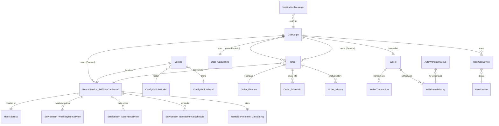

# Database Design — AllianceMiddleman

## Mục lục
- [Tổng quan](#tổng-quan)
- [DbContext](#dbcontext)
- [AppSystemDataContext — Entities](#appsystemdatacontext--entities)
- [BusinessDataContext — Entities](#businessdatacontext--entities)
- [Stored Procedures](#stored-procedures)
- [Naming conventions](#naming-conventions)

---

## Tổng quan

Hệ thống tách biệt dữ liệu theo 2 domain thông qua 2 `DbContext` riêng:

| Context | File | Domain | Số entities |
|---------|------|--------|------------|
| `AppSystemDataContext` | `Data/AppSystem/AppSystemDataContext.cs` | Hệ thống: account, staff, device, config | ~9 entities |
| `BusinessDataContext` | `Data/BusinessData/BusinessDataContext.cs` | Nghiệp vụ: order, rental, user, vehicle, payment | 100+ entities |

**Database được hỗ trợ:**
- **SQL Server** — primary, toàn bộ business data
- **PostgreSQL** — secondary/optional cho một số module

**ORM:** Entity Framework Core 5.0 — Code-first, fluent configuration

---

## DbContext

### AppSystemDataContext

**File:** `AllianceMiddlemanWebAPI.Core/Data/AppSystem/AppSystemDataContext.cs`

Quản lý dữ liệu hệ thống, dùng chung cho nhiều module.

```csharp
public class AppSystemDataContext : DbContext
{
    // Được inject qua DI với connection string: "DefaultConnection" hoặc module-specific
}
```

### BusinessDataContext

**File:** `AllianceMiddlemanWebAPI.Core/Data/BusinessData/BusinessDataContext.cs`

Quản lý toàn bộ dữ liệu nghiệp vụ của Sigo.

```csharp
public class BusinessDataContext : DbContext
{
    // Kết nối SQL Server, chứa 100+ DbSet cho business entities
}
```

---

## AppSystemDataContext — Entities

### Nhóm: User Login & Registration

| Entity | File | Mô tả |
|--------|------|-------|
| `UserLogin_RegisterInfo` | `AppSystemEntities.UserLogin_RegisterInfo.cs` | Thông tin đăng ký tài khoản (phone, email, hash password) |
| `UserLogin_Ext` | `AppSystemEntities.UserLogin_Ext.cs` | Mở rộng thông tin login (metadata, flags) |
| `UserLogin_TaxInfo` | `AppSystemEntities.UserLogin_TaxInfo.cs` | Thông tin thuế gắn với tài khoản |

### Nhóm: Device Management

| Entity | File | Mô tả |
|--------|------|-------|
| `UserDevice` | `AppSystemEntities.UserDevice.cs` | Thiết bị đã đăng ký của user (push token, platform) |
| `UserUseDevice` | `AppSystemEntities.UserUseDevice.cs` | Lịch sử user dùng thiết bị nào |

### Nhóm: System Configuration

| Entity | File | Mô tả |
|--------|------|-------|
| `SystemB2BConfig` | `AppSystemEntities.SystemB2BConfig.cs` | Cấu hình B2B partner |
| `SystemBusinessChangeTracking` | `AppSystemEntities.SystemBusinessChangeTracking.cs` | Audit trail thay đổi cấu hình hệ thống |
| `CompareConfigTableData` | `AppSystemEntities.CompareConfigTableData.cs` | Dữ liệu bảng so sánh cấu hình |
| `CompareConfigTableKey` | `AppSystemEntities.CompareConfigTableKey.cs` | Key mapping bảng so sánh cấu hình |

---

## BusinessDataContext — Entities

### Nhóm: Order (Đơn hàng)

Nhóm core của hệ thống — quản lý toàn bộ vòng đời đơn thuê xe.

| Entity | Mô tả |
|--------|-------|
| `Order` | Đơn hàng chính: renter, owner, trạng thái, thời gian thuê |
| `Order_ChangeStatus` | Lịch sử thay đổi trạng thái của đơn |
| `Order_Finance` | Thông tin tài chính chi tiết (base price, fees, discounts) |
| `Order_Payment` | Phương thức thanh toán và trạng thái thanh toán |
| `Order_Rating` | Đánh giá sau khi hoàn tất chuyến |
| `Order_Rating_File` | File ảnh đính kèm đánh giá |
| `Order_ReceiveVehicle_Image` | Metadata ảnh nhận/trả xe |
| `Order_ReceiveVehicle_Image_File` | File ảnh nhận/trả xe |
| `Order_ReportHistory` | Lịch sử báo cáo sự cố của đơn |
| `Order_Setting` | Cài đặt riêng per-order |
| `Order_Vehicle` | Xe được assign cho đơn hàng |
| `Order_Vehicle_Address` | Địa chỉ nhận/trả xe |
| `Order_Vehicle_InsuranceSubmitted` | Thông tin bảo hiểm nộp theo đơn |
| `Order_SMS_CompanyBankAccountActivity_Mapping` | Mapping SMS ngân hàng với đơn hàng |
| `Order_DiscountCode_Applied_OneTimeUse` | Mã giảm giá đã áp dụng (one-time) |

### Nhóm: Vehicle (Xe)

| Entity | Mô tả |
|--------|-------|
| `Vehicle` | Thông tin xe (biển số, hãng, model, năm sản xuất) |
| `Vehicle_InsuranceInformation` | Thông tin bảo hiểm xe |
| `Vehicle_RentalSetting` | Cài đặt cho thuê của xe (deposit, cho phép giao xe...) |
| `VehicleDiscountSuggestion` | Gợi ý giảm giá cho xe |
| `VehicleMultidayRentalDiscount_Detail` | Chi tiết giảm giá thuê nhiều ngày |

### Nhóm: Rental Service & Service Item

| Entity | Mô tả |
|--------|-------|
| `RentalService` | Dịch vụ cho thuê (gói dịch vụ của owner) |
| `RentalService_SelfdriveCarRental` | Cài đặt riêng cho self-drive rental |
| `ServiceRentalSetting` | Cài đặt chung của service |
| `RentalServiceItem` | Item cụ thể trong dịch vụ (1 xe = 1 service item) |
| `RentalServiceItem_Calculating` | Dữ liệu tính toán/thống kê của service item |
| `RentalServiceItem_ChangeStatus` | Lịch sử thay đổi trạng thái service item |
| `RentalServiceItemPriorityList` | Thứ tự ưu tiên hiển thị trong danh sách |
| `RentalServiceItemViewHistory` | Lịch sử lượt xem của service item |
| `RentalServiceTempData` | Dữ liệu tạm thời trong quá trình booking |
| `ServiceItem_BookedRentalSchedule` | Lịch đã đặt (confirmed bookings) |
| `ServiceItem_DateBusyRentalSchedule` | Ngày xe bận (owner tự đánh dấu) |
| `ServiceItem_DateRentalPrice` | Giá theo ngày cụ thể (override giá mặc định) |
| `ServiceItem_WeekdayRentalPrice` | Giá theo thứ trong tuần |
| `ServiceItem_WeekdaysBusyRentalSchedule` | Thứ bận theo tuần |
| `ServiceItem_MinimumRentalDayRequired` | Số ngày thuê tối thiểu |
| `ServiceItem_Document` | Tài liệu yêu cầu (CMND, GPLX...) |
| `ServiceItem_Document_File` | File tài liệu |
| `ServiceItem_Feature_Mapping` | Tính năng xe (điều hòa, GPS, camera...) |
| `ServiceItem_Image` | Metadata ảnh service item |
| `ServiceItem_Image_File` | File ảnh service item |
| `ServiceItem_RentalRequiredItem_Mapping` | Vật dụng yêu cầu khi thuê |

### Nhóm: User (Người dùng)

| Entity | Mô tả |
|--------|-------|
| `UserAccessRegisterToken` | Token đăng ký/access của user |
| `UserActionHistory` | Lịch sử hành động của user |
| `UserVerified` | Trạng thái xác minh danh tính (CMND, GPLX) |
| `UserItem_Image` | Metadata ảnh hồ sơ user |
| `UserItem_Image_File` | File ảnh hồ sơ |
| `UserItem_ImageVerified` | Ảnh đã xác minh |
| `UserLogin_BeneficiaryBank_Mapping` | Tài khoản ngân hàng thụ hưởng |
| `User_Calculating` | Thống kê tổng hợp của user (tổng chuyến, rating...) |
| `User_Calculating_OrderStatus` | Thống kê theo trạng thái đơn |
| `ReportUser` | Báo cáo vi phạm từ user khác |

### Nhóm: Notification (Thông báo)

| Entity | Mô tả |
|--------|-------|
| `NotificationMessage` | Tin nhắn thông báo gửi tới user |
| `NotificationTemplate` | Mẫu thông báo (title + body + type) |
| `ProactiveNotification` | Thông báo chủ động theo điều kiện |
| `ProactiveNotificationDetail` | Chi tiết điều kiện trigger |
| `PushNotificationHistory` | Lịch sử push notification đã gửi |

### Nhóm: Support Chat

| Entity | Mô tả |
|--------|-------|
| `NotificationSupportSession` | Phiên chat hỗ trợ |
| `NotificationSupportMessage` | Tin nhắn trong phiên chat |
| `NotificationSupportAction` | Hành động trong phiên hỗ trợ |
| `NotificationSupportTemplate` | Mẫu tin nhắn hỗ trợ |
| `NotificationSupportTemplateAction` | Action gắn với mẫu |
| `NotificationSupportTemplateMessage` | Message gắn với mẫu |

### Nhóm: Quick Order

| Entity | Mô tả |
|--------|-------|
| `QuickOrderRequest` | Yêu cầu đặt xe nhanh |
| `QuickOrderRequestDetail` | Chi tiết yêu cầu |
| `QuickOrderSuggestion` | Gợi ý xe phù hợp cho quick order |
| `QuickOrderSuggestionDetail` | Chi tiết xe được gợi ý |

### Nhóm: Financial & Wallet

| Entity | Mô tả |
|--------|-------|
| `AutoWithdrawQueue` | Hàng chờ rút tiền tự động |
| `WithdrawalHistory` | Lịch sử giao dịch rút tiền |
| `DiscountCode_Summary` | Tổng hợp sử dụng mã giảm giá |
| `CoinReward_Process` | Xử lý thưởng coin/điểm |

### Nhóm: MB Bank Integration

| Entity | Mô tả |
|--------|-------|
| `SMS_CompanyBankAccountActivity` | Giao dịch ngân hàng nhận qua SMS |
| `SMS_CompanyBankAccountActivity_Import_Log` | Log import SMS |
| `MBBank_APICall_Log` | Log các API call tới MB Bank |
| `Log_EWallet_MBBank` | Log giao dịch EWallet ↔ MB Bank |

### Nhóm: Mioto Integration

| Entity | Mô tả |
|--------|-------|
| `Mioto_VehicleInfo` | Thông tin xe từ Mioto platform |
| `Mioto_VehicleOwner` | Chủ xe trên Mioto |
| `Mioto_VehiclePricing` | Giá xe từ Mioto |
| `Mioto_VehicleQuery` | Query log tìm kiếm Mioto |
| `Mioto_VehicleTripCountDetail` | Chi tiết số chuyến xe Mioto |
| `Mioto_Sigo_Car_Mapping` | Mapping xe giữa Mioto và Sigo |

### Nhóm: VietQR

| Entity | Mô tả |
|--------|-------|
| `VietQR_BankAccountLookupLog` | Log tra cứu tài khoản ngân hàng |
| `VietQR_CitizenLookupLog` | Log tra cứu thông tin CCCD |

### Nhóm: File Management

| Entity | Mô tả |
|--------|-------|
| `FileWillBeDownload` | Hàng chờ file cần download/export |
| `FileWillBeDownloadDetail` | Chi tiết từng file |
| `ImageCompressionQueue` | Hàng chờ nén ảnh |

### Nhóm: Logging & Audit

| Entity | Mô tả |
|--------|-------|
| `Log_VehicleRental_CreateOrder` | Log tạo đơn thuê xe |
| `Log_DistanceMatrixAPI` | Log gọi Google Distance Matrix API |
| `Log_GetOTP` | Log yêu cầu OTP |
| `Log_MISAInvoice_PublishHSM` | Log xuất hoá đơn MISA |
| `GetOTPBlacklist` | Blacklist số điện thoại bị giới hạn OTP |

### Nhóm: Search & Location

| Entity | Mô tả |
|--------|-------|
| `Searching_Distance` | Cache kết quả tính khoảng cách |
| `HostAddress` | Địa chỉ host/server cho search |

---

## Stored Procedures

Định nghĩa trong: `AllianceMiddlemanWebAPI.Core/Data/Stores/EEzyStoredProcedureNames.cs`

Tổng cộng **14 stored procedures**, tất cả trả về JSON:

| Tên SP | Mục đích |
|--------|---------|
| `sp_GetMessageQueueReport_Json` | Báo cáo hàng chờ tin nhắn |
| `sp_GetSMSQueueReport_Json` | Báo cáo hàng chờ SMS |
| `sp_GetReduceWebSupport_Url_Json` | Rút gọn URL support web |
| `sp_GetIPAddressFromLog_PropertyChanged_Today_Json` | Lấy IP từ log thay đổi hôm nay |
| `sp_GetNotifyMessage4Push_Json` | Lấy tin nhắn cần push notification |
| `sp_GetDataReportWebsite4BCT_Json` | Dữ liệu báo cáo website cho BCT |
| `sp_AutoInsertStaff_Json` | Tự động thêm staff |
| `sp_report_VehicleMasterLocationNotSameDetail_Json` | Báo cáo xe có địa chỉ không khớp |
| `sp_GetHostAddressForSearch_Json` | Lấy host address cho tìm kiếm |
| `sp_GetUnreadLatestNotify_Json` | Lấy notification chưa đọc mới nhất |
| `sp_GetRentalServiceItemViewReport_Json` | Báo cáo lượt xem service item |
| `sp_GetOwnerForDiscountNotification_Json` | Lấy owner cần nhận thông báo discount |
| `sp_Get_OrderOverTimeButDontEnd_Json` | Đơn hàng quá hạn chưa kết thúc |
| `sp_GetOrdersNeedUnhidePhone_Json` | Đơn cần ẩn/hiện số điện thoại |

> **Lưu ý:** Tất cả SP đều trả về dạng JSON string. Caller tự parse JSON sau khi nhận kết quả.

---

## Entity Schema chi tiết — Các entity quan trọng

> Lấy từ source code C# entity files. Tất cả entity nghiệp vụ có base fields chung:
> `Id` (long, PK), `IsDeleted` (bool), `Log_CreatedDate`, `Log_CreatedBy`, `Log_UpdatedDate`, `Log_UpdatedBy`, `Note`, `OrderNo`, `IsDisable`.

### Order (Đơn hàng chính) — 74 fields + 12 navigation properties

**File:** `BusinessEntities.Order.cs`

> Base fields (Id, IsDeleted, Log_CreatedDate, Log_CreatedBy, Log_UpdatedDate, Log_UpdatedBy, Note, OrderNo, IsDisable) không liệt kê lại.

**Nhóm: Identification & Source**

| Column | Type | Nullable | Mô tả |
|--------|------|----------|-------|
| OrderNumber | string(250) | Có | Mã đơn hiển thị, format: ORD-{date}-{seq} |
| EntDate | DateTime | Có | Entry/Creation date |
| ID_GUID | Guid | Có | UUID cho external reference |
| RentalServiceCategoryId | long | Có | FK → ConfigRentalServiceCategory |
| RentalServiceItemGUID | Guid | Có | UUID của RentalServiceItem |
| CreatedByUsername | string | Có | Username tạo đơn |
| CreatedFromSourceJson | string | Có | JSON data nguồn tạo đơn |
| CreatedFromIP | string(250) | Có | IP tạo đơn |
| IsExternalOrder | bool | Không | Đơn từ bên thứ 3 |
| IsFromQuickOrder | bool | Không | Từ QuickOrder flow |
| IsFromQuickOrder_Auto | bool | Không | Auto-created từ QuickOrder |
| HaveCheckAutoCreateQuickOrder | bool | Không | Đã check auto-create chưa |
| SecurityInfo | string | Có | Security/verification info |

**Nhóm: Participants (FK → User)**

| Column | Type | Nullable | Mô tả |
|--------|------|----------|-------|
| RentalServiceItemId | long | Có | FK → RentalServiceItem |
| UserId | long | Có | FK → User (người đặt) |
| UserPhoneNumber | string | Có | SĐT người đặt |
| UserName | string | Có | Tên người đặt |
| OwnerId | long | Có | FK → User (chủ xe) |
| OwnerPhoneNumber | string | Có | SĐT chủ xe |
| OwnerName | string | Có | Tên chủ xe |
| OwnerID_GUID | Guid | Có | UUID chủ xe |
| RenterId | long | Có | FK → User (người thuê, có thể khác UserId) |
| RenterPhoneNumber | string | Có | SĐT người thuê |
| RenterName | string | Có | Tên người thuê |
| RenterID_GUID | Guid | Có | UUID người thuê |
| RenterReceiverName | string | Có | Tên người nhận xe |
| RenterReceiverPhone | string | Có | SĐT người nhận xe |

**Nhóm: Rental Period**

| Column | Type | Nullable | Mô tả |
|--------|------|----------|-------|
| FromDate | DateTime | Có | Ngày giờ nhận xe |
| ToDate | DateTime | Có | Ngày giờ trả xe |
| NumberOfRentalDay | int | Có | Số ngày thuê |

**Nhóm: Status**

| Column | Type | Nullable | Mô tả |
|--------|------|----------|-------|
| StatusId | long | Có | FK → ConfigOrderStatus |
| StatusCode | string(50) | Có | OWNER2CONFIRM, CUS2DEPOSIT, WAITING2CONFIRMDEPOSIT, WAITING2DEPARTURE, INTHETRIP, DONE, CUSCANCEL, OWNERCANCEL, SYSTEMCANCEL |
| StatusName | string(250) | Có | Tên trạng thái hiển thị |
| OrderStatusId | long | Có | FK → OrderStatus (alias) |
| OrderStatusCode | string | Có | Order status code (alias) |
| OrderStatusName | string | Có | Order status display name |
| OwnerStatusId | long | Có | Status riêng phía owner |
| OwnerStatusCode | string | Có | Owner status code |
| OwnerStatusName | string | Có | Owner status display name |
| IsCancel | bool | Không | Đã huỷ |
| IsDone | bool | Không | Đã hoàn thành |
| IsSystemAutoDone | bool | Không | Auto-complete bởi engine |

**Nhóm: Pricing & Payment**

| Column | Type | Nullable | Mô tả |
|--------|------|----------|-------|
| PaymentTypeId | long | Có | FK → ConfigPaymentType |
| PriceByDay | decimal(20,6) | Có | Giá thuê/ngày (sau giảm giá) |
| OriginalPriceByDay | decimal(20,6) | Có | Giá gốc/ngày trước giảm giá |
| TotalPriceByDay | decimal(20,6) | Có | Tổng giá theo ngày |
| TotalOriginalPrice | decimal(20,6) | Có | Tổng giá gốc trước mọi thay đổi |
| SubTotal | decimal(20,6) | Có | Tổng trước giảm giá |
| PromotionMoney | decimal(20,6) | Có | Giảm giá khuyến mãi (multiday discount) |
| PromotionNumOfMinDay | int | Có | Số ngày tối thiểu cho promotion |
| DiscountMoney | decimal(20,6) | Có | Giảm giá voucher/mã |
| MaximumDiscountMoney | decimal(20,6) | Có | Giới hạn tối đa giảm giá |
| TotalPrice | decimal(20,6) | Có | Tổng tiền cuối cùng |
| ServiceFee | decimal(20,6) | Có | Phí dịch vụ platform |

**Nhóm: Deposit**

| Column | Type | Nullable | Mô tả |
|--------|------|----------|-------|
| DepositAmount | decimal(20,6) | Có | Tiền cọc yêu cầu |
| DepositAmountPaid | decimal(20,6) | Có | Tiền cọc đã trả |
| DepositAmountRemain | decimal(20,6) | Có | Tiền cọc còn thiếu |
| AmountRemain | decimal(20,6) | Có | Tổng tiền còn lại phải trả |
| DepositDoneAt | DateTime | Có | Thời điểm hoàn tất cọc |
| IsUserDoneDeposit | bool | Không | Đã cọc xong chưa |

**Nhóm: Deadlines & Workflow**

| Column | Type | Nullable | Mô tả |
|--------|------|----------|-------|
| Owner2ConfirmEndTime | DateTime | Có | Hạn chót owner confirm (+3h business hours) |
| Customer2DepositEndTime | DateTime | Có | Hạn chót renter đặt cọc (+3h business hours) |
| MessageToOwner | string | Có | Lời nhắn cho chủ xe |

**Nhóm: Auto-matching**

| Column | Type | Nullable | Mô tả |
|--------|------|----------|-------|
| IsAutoFindOwner | bool | Không | Owner được auto-matched |
| FindingOwnerPriority | int | Có | Thứ tự ưu tiên matching |

**Navigation Properties (12):**

| Navigation | Type | Mô tả |
|------------|------|-------|
| Order_Setting | `IList<Order_Setting>` | Cài đặt riêng per-order |
| Order_Rating | `IList<Order_Rating>` | Đánh giá sau chuyến |
| Order_SMS_CompanyBankAccountActivity_Mapping | `IList<...>` | Mapping SMS ngân hàng |
| Order_Vehicle_InsuranceSubmitted | `IList<...>` | Bảo hiểm nộp theo đơn |
| Order_Finance | `IList<Order_Finance>` | Chi tiết tài chính |
| Order_Payment | `IList<Order_Payment>` | Thanh toán |
| Order_ChangeStatus | `IList<Order_ChangeStatus>` | Lịch sử trạng thái |
| Order_ReceiveVehicle_Image | `IList<...>` | Ảnh nhận/trả xe |
| Order_Vehicle | `IList<Order_Vehicle>` | Xe assign |
| Order_DiscountCode_Applied_OneTimeUse | `IList<...>` | Mã giảm giá đã dùng |
| QuickOrderSuggestion | `IList<QuickOrderSuggestion>` | Gợi ý QuickOrder |
| QuickOrderSuggestionDetail | `IList<QuickOrderSuggestionDetail>` | Chi tiết gợi ý |

### Order_Finance (Tài chính đơn hàng)

**File:** `BusinessEntities.Order_Finance.cs`

| Column | Type | Nullable | Mô tả |
|--------|------|----------|-------|
| OrderId | long | Có | FK → Order |
| PlanProfitAmount | decimal(20,6) | Có | Lợi nhuận platform dự kiến |
| ActualProfitAmount | decimal(20,6) | Có | Lợi nhuận thực tế |
| OwnerRemainAmount | decimal(20,6) | Có | Số tiền owner còn nhận |
| OwnerCancelRefund | decimal(20,6) | Có | Hoàn tiền khi owner huỷ (số âm = owner trả) |
| RenterCancelRefund | decimal(20,6) | Có | Hoàn tiền cho renter khi huỷ |
| RenterCancelEarn | decimal(20,6) | Có | Renter nhận thêm khi huỷ |
| PlanCancelProfitAmount | decimal(20,6) | Có | Lợi nhuận platform từ huỷ |
| ActualRenterCancelRefund | decimal(20,6) | Có | Hoàn tiền renter thực tế |
| ActualOwnerCancelRefund | decimal(20,6) | Có | Hoàn tiền owner thực tế |
| IsDontHaveCancellationFee | bool | Không | Miễn phí huỷ |
| OwnerWithholdingTaxAmount | decimal(18,6) | Có | Thuế khấu trừ owner |

### Order_Payment (Thanh toán)

**File:** `BusinessEntities.Order_Payment.cs`

| Column | Type | Nullable | Mô tả |
|--------|------|----------|-------|
| OrderId | long | Có | FK → Order |
| PaymentAction | string | Có | Loại action (deposit, refund, pay...) |
| PaymentType | string | Có | E-wallet, Bank, Cash... |
| Amount | decimal(20,6) | Có | Số tiền |
| IsApproved | bool | Có | Đã duyệt |
| ApprovedAt | DateTime | Có | Thời điểm duyệt |
| IsSuccessful | bool | Có | Thanh toán thành công |
| WalletActionTransferGuid | Guid | Có | Ref giao dịch ví |
| IsIgnore | bool | Không | Bỏ qua payment |

### Vehicle (Xe) — 33 fields + 2 navigation properties

**File:** `BusinessEntities.Vehicle.cs`

> Base fields (Id, IsDeleted, Log_*, Note, OrderNo, IsDisable) không liệt kê lại.

**Nhóm: Identification**

| Column | Type | DB Type | Nullable | Mô tả |
|--------|------|---------|----------|-------|
| PlateNumber | string(100) | varchar(100) | Có | Biển số xe |
| Name | string(500) | varchar(500) | Có | Tên xe hiển thị |
| ID_GUID | Guid | uuid | Có | UUID, auto gen_random_uuid() |

**Nhóm: Classification (FK → Config*)**

| Column | Type | DB Type | Nullable | Mô tả |
|--------|------|---------|----------|-------|
| VehicleTypeId | long | int8 | Có | FK → ConfigVehicleType |
| VehicleTypeSubId | long | int8 | Có | FK → ConfigVehicleTypeSub |
| VehicleNoOfSeatId | long | int8 | Có | FK → ConfigNoOfSeat |
| FuelTypeId | long | int8 | Có | FK → ConfigFuelType |
| VehicleColorId | long | int8 | Có | FK → ConfigColor |
| VehicleTransmissionTypeId | long | int8 | Có | FK → ConfigTransmission |
| VehicleMakeId | long | int8 | Có | FK → ConfigMake (hãng) |
| MakeCountryId | long | int8 | Có | FK → ConfigCountry (nước sản xuất) |
| VehicleModelId | long | int8 | Có | FK → ConfigModel (dòng xe) |

**Nhóm: Technical Specifications**

| Column | Type | DB Type | Nullable | Mô tả |
|--------|------|---------|----------|-------|
| EngineNumber | string(100) | varchar(100) | Có | Số máy |
| ChassicNumber | string(100) | varchar(100) | Có | Số khung |
| PistonDisplacement | string(100) | varchar(100) | Có | Dung tích xi lanh |
| NumOfCylinders | int | int4 | Có | Số xi lanh |
| Series | string(250) | varchar(250) | Có | Phiên bản/series |
| YearModel | int | int4 | Có | Năm sản xuất |
| FuelEfficiency | string(250) | varchar(250) | Có | Mức tiêu hao nhiên liệu |

**Nhóm: Weight & Capacity**

| Column | Type | DB Type | Nullable | Mô tả |
|--------|------|---------|----------|-------|
| GrossWeight | decimal(18,3) | numeric(18,3) | Có | Tổng trọng |
| NetWeight | decimal(18,3) | numeric(18,3) | Có | Trọng lượng tịnh |
| ShippingWeight | decimal(18,3) | numeric(18,3) | Có | Trọng lượng vận chuyển |
| NetCapacity | decimal(18,3) | numeric(18,3) | Có | Sức chứa tịnh |

**Nhóm: Vehicle Registration Certificate (VRC)**

| Column | Type | DB Type | Nullable | Mô tả |
|--------|------|---------|----------|-------|
| VRC_OriginalRegistrationNumber | string(250) | varchar(250) | Có | Số đăng ký gốc |
| VRC_OriginalRegistrationDate | DateTime | date | Có | Ngày đăng ký gốc |
| VRC_ExpiryRegistrationDate | DateTime | date | Có | Hạn đăng kiểm |

**Navigation Properties (2):**

| Navigation | Type | Mô tả |
|------------|------|-------|
| RentalService_SelfdriveCarRental | `IList<RentalService_SelfdriveCarRental>` | Dịch vụ tự lái gắn với xe |
| Vehicle_InsuranceInformation | `IList<Vehicle_InsuranceInformation>` | Bảo hiểm xe |

### RentalServiceItem (Dịch vụ cho thuê = 1 xe) — 25 fields + 3 navigation properties

**File:** `BusinessEntities.RentalServiceItem.cs`

> Base fields không liệt kê lại.

| Column | Type | Nullable | Mô tả |
|--------|------|----------|-------|
| RentalServiceCategoryId | long | Có | FK → Category (luôn = RENT_CAR) |
| OwnerId | long | Có | FK → User (chủ xe) |
| OwnerGUID | Guid | Có | UUID owner |
| RentalPrice | decimal(20,6) | Có | Giá thuê mặc định/ngày |
| HostAddressId | long | Có | FK → HostAddress (địa chỉ xe) |
| RentalSettingId | long | Có | FK → ServiceRentalSetting |
| IsSuspended | bool | Không | Tạm ngưng (bị admin đình chỉ) |
| IsDeactive | bool | Không | Huỷ kích hoạt (owner tự tắt) |
| IsApproved | bool | Có | null=chờ duyệt, true=đã duyệt, false=từ chối |
| IsAddNew | bool | Không | Mới tạo, chưa submit |
| IsWaiting2Approve | bool | Không | Đang chờ admin duyệt |
| IsReApproved | bool | Không | Đã re-approve sau khi chỉnh sửa |
| ShortDescription | string | Có | Mô tả ngắn |
| FullDescription | string | Có | Mô tả chi tiết |
| Slug | string | Có | URL slug cho SEO |
| Alias | string | Có | Alias cho SEO |
| SKUNumber | string | Có | Mã SKU |
| ID_GUID | Guid | Bắt buộc | UUID (auto-generated) |
| LastSubmit2ApproveAt | DateTime | Có | Lần cuối submit duyệt |
| Comment | string | Có | Ghi chú admin khi duyệt |
| CommentAt | DateTime | Có | Thời điểm admin comment |
| ApprovedAt | DateTime | Có | Thời điểm duyệt |
| ApprovedById | long | Có | FK → admin đã duyệt |
| ApprovedByJson | string | Có | JSON thông tin admin duyệt |
| LastUpdateStatus | DateTime | Có | Lần cuối cập nhật trạng thái |

**Navigation Properties (3):**

| Navigation | Type | Mô tả |
|------------|------|-------|
| ServiceRentalSetting | `ServiceRentalSetting` | Cài đặt rental của xe |
| HostAddress | `HostAddress` | Địa chỉ xe đang đậu |
| RentalServiceItem_ChangeStatus | `IList<RentalServiceItem_ChangeStatus>` | Lịch sử đổi trạng thái |

### UserLogin_Ext (Thông tin mở rộng user) — 31 fields

**File:** `AppSystemEntities.UserLogin_Ext.cs`

> Partial class, implements `IProjectEntity`. Base fields không liệt kê lại.

| Column | Type | Nullable | Mô tả |
|--------|------|----------|-------|
| UserLoginId | long | Có | FK → UserLogin |
| VerifiedStepCode | string | Có | Bước xác minh hiện tại |
| Description | string | Có | Mô tả/bio |
| Files | string | Có | JSON file attachments |
| TimeStamp | byte[] | Có | Optimistic locking |
| TimeStampText | string | Có | Timestamp text |
| DateOfBirth | DateTime | Có | Ngày sinh |
| GenderCode | string(50) | Có | "MALE" / "FEMALE" |
| InviteCode | string | Có | Mã mời bạn bè |
| JoinedDate | DateTime | Có | Ngày tham gia |
| DisplayNameUnsign | string | Có | Tên không dấu (search) |
| PermanentAddress | string | Có | Địa chỉ thường trú |
| PermanentAddressLat | decimal(18,6) | Có | Lat địa chỉ thường trú |
| PermanentAddressLng | decimal(18,6) | Có | Lng địa chỉ thường trú |
| LastUpdatePermanentAddress | DateTime | Có | Lần cuối cập nhật địa chỉ |
| TaxCode | string | Có | Mã số thuế (ValueGeneratedNever) |
| IsBusy | bool | Không | Đang bận |
| FavVehicleModelIds | string | Có | JSON danh sách model yêu thích |
| FavVehicleMakeIds | string | Có | JSON danh sách hãng yêu thích |
| JobDescription | string | Có | Nghề nghiệp |
| LanguageCodes | string | Có | Ngôn ngữ (JSON array) |
| ProvinceId | long | Có | FK → ConfigAddress (tỉnh) |
| DistrictId | long | Có | FK → ConfigAddress (quận) |
| WardId | long | Có | FK → ConfigAddress (phường) |
| ContactZohoId | string | Có | [NotMapped] Zoho CRM Contact ID |
| ZohoLeadId | string | Có | [NotMapped] Zoho CRM Lead ID |

### Wallet (Ví điện tử) — 15 fields + 1 navigation property

**File:** `Ezy.Module.EWallet.Core/Data/BusinessData/BusinessEntities.Wallet.cs`

> Cũng có bản copy trong Ezy.Module.CMS.Core.

| Column | Type | Nullable | Mô tả |
|--------|------|----------|-------|
| Id | long | Không | PK, auto-increment |
| ID_GUID | Guid | Có | UUID |
| UserGuid | Guid | Có | UUID user sở hữu |
| WalletTypeId | long | Có | FK → WalletType (PAYMENT/SYSTEM/COIN) |
| Balance | decimal | Có | Số dư hiện tại |
| LastTransactionGuid | Guid | Có | UUID giao dịch cuối |
| Status | string | Có | Trạng thái ví |
| HashValue | string | Có | Hash integrity check |
| IsDeleted | bool | Không | Soft delete (default: false) |
| Log_CreatedDate | DateTime | Có | Ngày tạo |
| Log_CreatedBy | string | Có | Người tạo |
| Log_UpdatedDate | DateTime | Có | Ngày cập nhật |
| Log_UpdatedBy | string | Có | Người cập nhật |
| IsValid | bool | Không | Ví hợp lệ (default: true) |
| DeletedUserInfoJson | string | Có | JSON thông tin user đã xoá |

**Navigation:** `WalletTransaction` (`IList<WalletTransaction>`)

### WalletTransaction (Giao dịch ví) — 18 fields + 2 navigation properties

**File:** `Ezy.Module.EWallet.Core/Data/BusinessData/BusinessEntities.WalletTransaction.cs`

| Column | Type | Nullable | Mô tả |
|--------|------|----------|-------|
| Id | long | Không | PK, auto-increment |
| ID_GUID | Guid | Có | UUID |
| WalletGuid | Guid | Có | FK → Wallet (UUID) |
| UserGuid | Guid | Có | UUID user thực hiện |
| Action | string | Có | Loại giao dịch (FUNDING, TRANSFER, WITHDRAW) |
| ActionGuid | Guid | Có | FK → WalletAction (UUID) |
| BalanceChange | decimal | Có | Số tiền thay đổi (+/-) |
| BalanceBeforeTransaction | decimal | Có | Số dư trước giao dịch |
| BalanceAfterTransaction | decimal | Có | Số dư sau giao dịch |
| TranctionDate | DateTime | Có | Thời điểm giao dịch (lưu ý: typo trong code) |
| Initiator | string | Có | Bên khởi tạo (System/User/Admin) |
| RelatedWalletGuid | Guid | Có | UUID ví đối tác (transfer) |
| RelatedUserGuid | Guid | Có | UUID user đối tác |
| IsDeleted | bool | Không | Soft delete (default: false) |
| Log_CreatedDate | DateTime | Có | Ngày tạo |
| Log_CreatedBy | string | Có | Người tạo |
| Log_UpdatedDate | DateTime | Có | Ngày cập nhật |
| Log_UpdatedBy | string | Có | Người cập nhật |

**Navigation Properties (2):**

| Navigation | Type | Mô tả |
|------------|------|-------|
| Wallet | `Wallet` | FK → Wallet entity |
| WalletAction | `WalletAction` | FK → WalletAction entity |

---

## EF Core Conventions chung

### Precision Standards

| Loại dữ liệu | Precision | Áp dụng cho |
|---------------|-----------|-------------|
| Tiền tệ (VNĐ) | numeric(20,6) | PriceByDay, SubTotal, TotalPrice, Balance, DepositAmount... |
| Toạ độ GPS | numeric(18,6) | Latitude, Longitude, PermanentAddressLat/Lng |
| Trọng lượng | numeric(18,3) | GrossWeight, NetWeight, ShippingWeight |
| OrderNo | numeric(20,6) | Thứ tự hiển thị — mọi entity |

### Default Values

| Property | Default | Ghi chú |
|----------|---------|---------|
| IsDeleted | false | Soft delete flag |
| IsDisable | false | Trạng thái vô hiệu |
| OrderNo | 0 | Thứ tự sắp xếp |
| IsValid (Wallet) | true | Wallet integrity |
| ID_GUID | gen_random_uuid() | PostgreSQL auto-gen UUID |

### GUID Generation

- **PostgreSQL:** `ValueGeneratedOnAdd()` + `HasDefaultValueSql("gen_random_uuid()")`
- **SQL Server:** `NEWSEQUENTIALID()` hoặc application-level `Guid.NewGuid()`
- Convention: dùng `ID_GUID` cho external/API reference, `Id` (long) cho internal FK

### ServiceItem_BookedRentalSchedule (Lịch đã đặt)

**File:** `BusinessEntities.ServiceItem_BookedRentalSchedule.cs`

| Column | Type | Nullable | Mô tả |
|--------|------|----------|-------|
| RentalServiceItemId | long | Có | FK → RentalServiceItem |
| FromDate | DateTime | Có | Ngày bắt đầu booking |
| ToDate | DateTime | Có | Ngày kết thúc booking |
| IsBooked | bool | Có | true = đang booked, false = đã huỷ |

### ServiceItem_DateBusyRentalSchedule (Ngày bận thủ công)

**File:** `BusinessEntities.ServiceItem_DateBusyRentalSchedule.cs`

| Column | Type | Nullable | Mô tả |
|--------|------|----------|-------|
| RentalServiceItemId | long | Có | FK → RentalServiceItem |
| FromDate | DateTime | Có | Bắt đầu bận |
| ToDate | DateTime | Có | Kết thúc bận |
| IsBusy | bool | Có | Trạng thái bận |
| LastUpdatedByOwnerDate | DateTime | Có | Owner cập nhật lần cuối |

### ServiceItem_DateRentalPrice (Giá theo ngày)

**File:** `BusinessEntities.ServiceItem_DateRentalPrice.cs`

| Column | Type | Nullable | Mô tả |
|--------|------|----------|-------|
| RentalServiceItemId | long | Có | FK → RentalServiceItem |
| FromDate | DateTime | Có | Ngày bắt đầu áp dụng giá |
| ToDate | DateTime | Có | Ngày kết thúc |
| RentalPrice | decimal(20,6) | Có | Giá override |
| RentalPriceOld | decimal(20,6) | Có | Giá cũ (trước khi đổi) |
| PercentPrice | decimal(20,6) | Có | % giảm giá |

### RentalServiceItem_Calculating (Thống kê xe cho thuê) — 18 fields

**File:** `BusinessEntities.RentalServiceItem_Calculating.cs`

> Bảng denormalized — chứa thống kê tính toán cho từng RentalServiceItem. Được cập nhật bởi `UpdateRentalServiceItem_Calculating_RentCarEngine`.

| Column | Type | Nullable | Mô tả |
|--------|------|----------|-------|
| Id | long | Không | PK, auto-increment |
| RentalServiceItemId | long | Có | FK → RentalServiceItem |
| RentalServiceItemGUID | Guid | Có | UUID tham chiếu |
| ServedCount | long | Có | Tổng số chuyến hoàn tất |
| OrderCount | long | Có | Tổng số đơn (bao gồm cancel) |
| RateCount | long | Có | Số lượt đánh giá |
| Rating | decimal | Có | Rating trung bình (1.0-5.0) |
| ViewCount | long | Có | Tổng lượt xem |
| SearchCount | long | Có | Tổng lượt xuất hiện trong search |
| IsGreaterThanMedPrice | bool | Có | Giá cao hơn trung bình khu vực |
| ID_GUID | Guid | Có | UUID (auto-gen) |
| IsDeleted | bool | Không | Soft delete |
| OrderNo | decimal(20,6) | Không | Thứ tự |
| IsDisable | bool | Không | Vô hiệu hóa |

### User_Calculating (Thống kê user) — 28 fields

**File:** `BusinessEntities.User_Calculating.cs`

> Bảng denormalized — chứa thống kê tổng hợp cho user (cả vai trò Owner và Renter). Được cập nhật bởi `User_Calculating_RentCarEngine`.

| Column | Type | Nullable | Mô tả |
|--------|------|----------|-------|
| Id | long | Không | PK, auto-increment |
| UserId | long | Có | FK → UserLogin |
| UserGUID | Guid | Có | UUID tham chiếu |
| CompletedOrderCount | long | Có | Tổng đơn hoàn tất (vai trò renter) |
| TotalOrderCount | long | Có | Tổng đơn (vai trò renter) |
| DoneOrderCount | int | Có | Tổng đơn Done |
| CancelOrderCount | int | Có | Tổng đơn Cancel |
| Renter_Rating | decimal | Có | Rating trung bình (vai trò renter) |
| Renter_RateCount | long | Có | Số lượt đánh giá nhận được (renter) |
| Renter_ViewCount | long | Có | Tổng lượt xem profile (renter) |
| CompletedRentalCount | long | Có | Tổng chuyến cho thuê hoàn tất (owner) |
| TotalRentalCount | long | Có | Tổng chuyến cho thuê (owner) |
| Owner_Rating | decimal | Có | Rating trung bình (vai trò owner) |
| Owner_RateCount | long | Có | Số lượt đánh giá nhận được (owner) |
| Owner_ViewCount | long | Có | Tổng lượt xem (owner) |
| OwnerResponseTime | decimal | Có | Thời gian phản hồi trung bình (phút) |
| Owner_IsUpdatedBusyDate | bool | Có | Owner đã cập nhật ngày bận chưa |
| AvgRating | decimal | Có | Rating tổng hợp (cả 2 vai trò) |
| RateCount | int | Có | Tổng lượt rate (cả 2 vai trò) |
| InteractWithAppAtUTC | DateTime | Có | Lần cuối tương tác với app |
| LastTimeCalculated | DateTime | Có | Lần cuối engine chạy tính toán |
| ID_GUID | Guid | Có | UUID (auto-gen) |
| IsDeleted | bool | Không | Soft delete |
| OrderNo | decimal(20,6) | Không | Thứ tự |
| IsDisable | bool | Không | Vô hiệu hóa |

### UserVerified (Xác minh danh tính)

**File:** `BusinessEntities.UserVerified.cs`

| Column | Type | Nullable | Mô tả |
|--------|------|----------|-------|
| UserLoginId | long | Có | FK → UserLogin |
| UserVerifiedId | long | Có | FK → ConfigVerificationType (CMND, GPLX...) |
| IsVerified | bool | Có | Đã xác minh chưa |
| ID_GUID | Guid | Có | UUID |

---

## Foreign Key Relationships (chính)

```
Order ──────────► RentalServiceItem (RentalServiceItemId)
Order ──────────► User (UserId, OwnerId, RenterId)
Order_Finance ──► Order (OrderId)
Order_Payment ──► Order (OrderId)
Order_Rating ───► Order (OrderId)

RentalService_SelfdriveCarRental ──► Vehicle (CarId)
RentalServiceItem ──► HostAddress (HostAddressId)
RentalServiceItem ──► ServiceRentalSetting (RentalSettingId)

ServiceItem_BookedRentalSchedule ──► RentalServiceItem
ServiceItem_DateBusyRentalSchedule ─► RentalServiceItem
ServiceItem_DateRentalPrice ────────► RentalServiceItem

Vehicle ──► Config* (VehicleTypeId, FuelTypeId, VehicleColorId, VehicleMakeId, VehicleModelId...)
UserVerified ──► UserLogin (UserLoginId)
UserDevice 1→N UserUseDevice (DeviceId, optional FK)
```

---

## EF Core OnModelCreating — Mappings chi tiết

### 4 DbContext

| Context | Base Class | Database | Vai trò |
|---------|-----------|----------|---------|
| `AppSystemDataContext` | `AppSystemEntities` | PostgreSQL | User login, device, system config |
| `BusinessDataContext` | `BusinessEntities` | PostgreSQL | Orders, vehicles, rental, payments |
| `CategoryDataContext` | `CategoryEntities` | PostgreSQL | 60+ config/lookup tables |
| `AppDataDataContext` | `AppDataEntities` | PostgreSQL | Application data, settings |

**Connection pattern:**
```csharp
public static AppSystemDataContext GetInstance(bool isDevMode, Func<string> fGetConnectionString)
{
    // Factory method — tạo instance với connection string
    // UseNpgsql cho PostgreSQL
}
```

### Column Mapping Conventions

```csharp
// Standard entity mapping pattern
modelBuilder.Entity<UserLogin_Ext>()
    .ToTable("UserLogin_Ext", "dbo")        // Schema: dbo
    .HasKey(x => x.Id);

// PK: auto-increment
.Property(x => x.Id)
    .HasColumnName("Id")
    .IsRequired()
    .ValueGeneratedOnAdd();                  // bigserial trong PostgreSQL

// Decimal precision
.Property(x => x.PermanentAddressLat)
    .HasPrecision(18, 6);                    // numeric(18,6)

.Property(x => x.OrderNo)
    .HasPrecision(20, 6);                    // numeric(20,6)

// String constraints
.Property(x => x.Log_CreatedBy)
    .HasMaxLength(500);

.Property(x => x.GenderCode)
    .HasMaxLength(50);

// Non-generated values
.Property(x => x.TaxCode)
    .ValueGeneratedNever();
```

### Relationship Mappings

```csharp
// One-to-Many: UserDevice → UserUseDevice
modelBuilder.Entity<UserDevice>()
    .HasMany(x => x.UserUseDevice)
    .WithOne(op => op.UserDevice)
    .HasForeignKey("DeviceId")
    .IsRequired(false);                      // Optional FK
```

### PostgreSQL-Specific Types

| C# Type | PostgreSQL Type | Ghi chú |
|---------|----------------|---------|
| `long` (PK) | `bigserial` | Auto-increment 64-bit |
| `DateTime?` | `timestamptz` | UTC timestamp with timezone |
| `decimal(20,6)` | `numeric(20,6)` | Precision cho tiền tệ |
| `decimal(18,6)` | `numeric(18,6)` | Precision cho lat/lng |
| `decimal(18,3)` | `numeric(18,3)` | Precision cho OrderNo |
| `bool` | `boolean` | |
| `Guid?` | `uuid` | |
| `byte[]` | `bytea` | Timestamp/version |
| `string(N)` | `varchar(N)` | HasMaxLength(N) |
| `string` (no limit) | `text` | |

### Standard Entity Base Fields

Tất cả entity nghiệp vụ có base fields:

```csharp
// Required fields (IEFBaseEntity)
long Id                    // PK, bigserial, auto-increment
bool IsDeleted             // Soft delete flag

// Audit fields
DateTime? Log_CreatedDate  // Auto-set khi insert (UTC)
string Log_CreatedBy       // varchar(500), user/system ID
DateTime? Log_UpdatedDate  // Auto-set khi update (UTC)
string Log_UpdatedBy       // varchar(500)

// Common optional fields (hầu hết entity có)
string Note                // text, ghi chú
decimal OrderNo            // numeric(20,6), thứ tự hiển thị
bool IsDisable             // Trạng thái vô hiệu
Guid? ID_GUID              // UUID, dùng cho external reference
byte[] TimeStamp           // bytea, optimistic locking
string TimeStampText       // varchar, timestamp text
```

---

## Database Indexes — Critical Performance

### PHASE1_CRITICAL_INDEXES (Production)

**1. RentalServiceItemViewHistory** — 427,904 queries/day
```sql
-- Main query index
CREATE INDEX idx_rental_view_history_main
ON dbo."RentalServiceItemViewHistory" ("RentalServiceItemId", "IsDeleted", "ViewIP", "ViewFrom", "ViewAt");

-- ViewAt filter index (partial)
CREATE INDEX idx_rental_view_history_viewat
ON dbo."RentalServiceItemViewHistory" ("ViewAt", "IsDeleted", "RentalServiceItemId")
WHERE "IsDeleted" = false;
-- Expected: 177ms → 0.5ms (350x faster)
```

**2. Order** — 70,166 queries/day
```sql
-- Unhide phone number + date filter
CREATE INDEX idx_order_unhide_phone
ON dbo."Order" ("DepositDoneAt", "FromDate", "EntDate", "StatusCode");

-- Status code lookup
CREATE INDEX idx_order_statusCode_id
ON dbo."Order" ("StatusCode", "Id");

-- Rental service item lookup
CREATE INDEX idx_order_rental_service
ON dbo."Order" ("RentalServiceItemId")
WHERE "RentalServiceItemId" IS NOT NULL;
```

**3. Order_ChangeStatus** — 1,713 queries/day
```sql
CREATE INDEX idx_order_changeStatus_orderId
ON dbo."Order_ChangeStatus" ("OrderId", "CancelReasonId", "ChangedDate");
```

**4. NotificationMessage**
```sql
CREATE INDEX idx_notification_entity_type
ON dbo."NotificationMessage" ("EntityId", "Type");
```

**5. ServiceItem_DateBusyRentalSchedule** — 427,904 queries/day
```sql
CREATE INDEX idx_busy_schedule_rental_dates
ON dbo."ServiceItem_DateBusyRentalSchedule" ("RentalServiceItemId", "FromDate", "ToDate");
-- Expected: 177ms → 0.5ms (350x faster)
```

---

## CategoryDataContext — Danh sách 60+ Config Tables

| Entity | Mô tả |
|--------|-------|
| `ConfigAddress` | Địa chỉ chuẩn (tỉnh/quận/phường) |
| `ConfigAppVersion` | Phiên bản app |
| `ConfigArea` | Khu vực địa lý |
| `ConfigBank` | Ngân hàng |
| `ConfigBeneficiaryBank` | Ngân hàng thụ hưởng (BIN codes) |
| `ConfigCompletionFee` | Phí hoàn thành dịch vụ |
| `ConfigCountry` | Quốc gia |
| `ConfigCriteriaPriority` | Tiêu chí ưu tiên |
| `ConfigDeliveryFee` | Phí giao xe (theo giờ/ngày, operators) |
| `ConfigDiscountCodeGroup` | Nhóm mã giảm giá |
| `ConfigDiscountMethod` | Phương thức giảm giá (Percent/Money) |
| `ConfigHMACKey` | HMAC signing keys |
| `ConfigLandingPage` | Landing page config |
| `ConfigLandingPage_File` | Landing page files |
| `ConfigLandingPageSetting` | Landing page settings |
| `ConfigMBBank` | MB Bank API config |
| `ConfigMISAInvoice` | MISA Invoice config |
| `ConfigMyOrderGroup` | Nhóm đơn hàng |
| `ConfigOrderStatus` | Trạng thái đơn |
| `ConfigPaymentType` | Loại thanh toán |
| `ConfigRentalRequiredItem` | Vật dụng bắt buộc khi thuê |
| `ConfigRentalServiceCategory` | Danh mục dịch vụ cho thuê |
| `ConfigRentalServiceRatingComment` | Mẫu comment đánh giá |
| `ConfigRentalServiceRatingPoint` | Thang điểm đánh giá |
| `ConfigReportOrderReason` | Lý do báo cáo đơn |
| `ConfigReportUserReason` | Lý do báo cáo user |
| `ConfigRSAKey` | RSA key pairs |
| `ConfigSFTP` | SFTP server config |
| `ConfigServiceDocumentType` | Loại tài liệu dịch vụ |
| `ConfigServiceImageType` | Loại ảnh dịch vụ |
| `ConfigServiceItemFeature` | Tính năng xe |
| `ConfigSlide` | Slide/Banner config |
| `ConfigSlide_File` | Slide files |
| `ConfigSlideScreenMapping` | Slide → screen mapping |
| `ConfigState` | Trạng thái chung |
| `ConfigUserImageType` | Loại ảnh user |
| `ConfigUserImageTypeDetail` | Chi tiết loại ảnh |
| `ConfigUserVerified` | Trạng thái xác minh |
| `ConfigVehicleColor` | Màu xe |
| `ConfigVehicleDiscountSuggestion` | Gợi ý giảm giá xe |
| `ConfigVehicleFuelType` | Loại nhiên liệu |
| `ConfigVehicleInsuranceCompany` | Công ty bảo hiểm |
| `ConfigVehicleMake` | Hãng xe |
| `ConfigVehicleModel` | Dòng xe |
| `ConfigVehicleMultidayRentalDiscount` | Giảm giá thuê nhiều ngày |
| `ConfigVehicleNoOfSeat` | Số chỗ ngồi |
| `ConfigVehicleRentalCancelReason` | Lý do huỷ đơn |
| `ConfigVehicleSegment` | Phân khúc xe |
| `ConfigVehicleTransmissionType` | Loại hộp số |
| `ConfigVehicleType` | Loại xe |
| `ConfigVehicleTypeSub` | Loại xe phụ |
| `BatchJob` | Batch job definitions |
| `Department` | Phòng ban |
| `DiscountCode` | Mã giảm giá |
| `Staff` | Nhân viên |
| `VietQR_Bank` | VietQR bank registry |

### Mapping Tables (Many-to-Many)

| Entity | Quan hệ |
|--------|---------|
| `ConfigVehicleFuelType_ConfigVehicleType_Mapping` | FuelType ↔ VehicleType |
| `ServiceCategory_ImageType_Mapping` | Category ↔ ImageType |
| `ServiceCategory_ImageType_InUseMapping` | Category ↔ ImageType (in-use) |
| `ServiceCategory_DocumentType_Mapping` | Category ↔ DocumentType |
| `ConfigServiceCategory_Feature_Mapping` | Category ↔ Feature |
| `ConfigRentalRequiredItem_ServiceCategory_Mapping` | RequiredItem ↔ Category |
| `ConfigOrderStatus_ServiceCategory_Mapping` | OrderStatus ↔ Category |
| `RentalServiceCategory_RentalServiceRatingComment_Mapping` | Category ↔ RatingComment |

---

## Stored Procedures — Chi tiết Parameters & Return Types

Tổng cộng **14 stored procedures**, tất cả dùng JSON-based execution pattern:

```csharp
// Execution pattern:
string jsonResult = BusinessDataContext.SP_Exce_JsonSP("sp_name", jsonParam);
// hoặc
string jsonResult = AppSystemDataContext.Exec_NonJsonStored_RAW_AnySP("sp_name");
// Gọi: SELECT dbo."sp_name"() hoặc SELECT dbo."sp_name"('jsonParam')
```

| # | SP Name | Parameters | Return Type (JSON) | Mô tả |
|---|---------|-----------|-------------------|-------|
| 1 | `sp_GetNotifyMessage4Push_Json` | `{"UserId": long}` | `PushNotifyItem[]` — `{Title, Body, FCMToken, EntityId, Type}` | Lấy notifications cần push |
| 2 | `sp_Get_OrderOverTimeButDontEnd_Json` | `{"MinutesAfterEnd": int}` | 2 arrays: `OrderOverTimeButDontEndInfo[]` (cảnh báo) + `OrderOver1HourButDontEndInfo[]` (auto-complete) | Đơn quá hạn |
| 3 | `sp_GetOrdersNeedUnhidePhone_Json` | `{"MinutesBeforeStart": int}` | `OrderUnhidePhoneInfo[]` — `{OrderId, FromDate, StatusCode}` | Đơn cần hiện SĐT |
| 4 | `sp_GetHostAddressForSearch_Json` | `{}` | `HostAddressInfo[]` — `{Id, Lat, Lng, ...}` | Host addresses cho search |
| 5 | `sp_GetUnreadLatestNotify_Json` | `{"UserId": long, "Top": int}` | `NotificationInfo[]` | Notifications chưa đọc |
| 6 | `sp_GetMessageQueueReport_Json` | `{}` | Report data | Báo cáo queue |
| 7 | `sp_GetSMSQueueReport_Json` | `{}` | Report data | Báo cáo SMS queue |
| 8 | `sp_GetReduceWebSupport_Url_Json` | `{}` | URL data | Rút gọn URL |
| 9 | `sp_GetIPAddressFromLog_PropertyChanged_Today_Json` | `{}` | `{IP, Count}[]` | IP audit today |
| 10 | `sp_GetDataReportWebsite4BCT_Json` | `{"FromDate": date, "ToDate": date}` | BCT report data | Báo cáo BCT |
| 11 | `sp_AutoInsertStaff_Json` | `{"UserLoginId": long}` | `{StaffId}` | Auto tạo staff |
| 12 | `sp_report_VehicleMasterLocationNotSameDetail_Json` | `{}` | `{VehicleId, MasterLocation, DetailLocation}[]` | Xe có location mismatch |
| 13 | `sp_GetRentalServiceItemViewReport_Json` | `{"FromDate": date, "ToDate": date}` | View statistics | Báo cáo lượt xem |
| 14 | `sp_GetOwnerForDiscountNotification_Json` | `{}` | `{OwnerId, VehicleId, Views, Bookings}[]` | Owner cần nhận thông báo discount |

---

## Naming conventions

### Entity naming
| Pattern | Ý nghĩa | Ví dụ |
|---------|---------|-------|
| `EntityName` | Entity chính | `Order`, `Vehicle`, `RentalServiceItem` |
| `EntityName_SubDomain` | Sub-entity | `Order_Payment`, `Order_Rating` |
| `EntityName_File` | File attachment | `Order_Rating_File`, `ServiceItem_Image_File` |
| `Log_*` | Audit/log entity | `Log_GetOTP`, `Log_DistanceMatrixAPI` |
| `Config*` | Configuration entity | `ConfigBank`, `ConfigAddress` |
| `*_Mapping` | Many-to-Many join | `ServiceCategory_ImageType_Mapping` |
| `*_Calculating` | Computed/statistics | `User_Calculating`, `RentalServiceItem_Calculating` |

### Primary key convention
- `long Id` — bigserial (auto-increment 64-bit) cho tất cả entities
- `Guid? ID_GUID` — UUID bổ sung cho external reference / API communication
- Dùng `Id` cho internal FK, dùng `ID_GUID` cho cross-service communication

### Soft delete
- Tất cả entity có `IsDeleted` (bool) — soft delete flag
- `GetQueryable()` mặc định filter `WHERE IsDeleted = false`
- `GetQueryableIncludeDeleted()` bỏ qua filter
- Background job `DeleteDataAfterAWeekJob` dọn dẹp data cũ weekly

---

## Entity Relationship — Core Domain (Mermaid)



---

*Xem thêm: [overview.md](./overview.md) | [background-engines.md](./background-engines.md) | [base-service-pattern.md](./base-service-pattern.md)*
