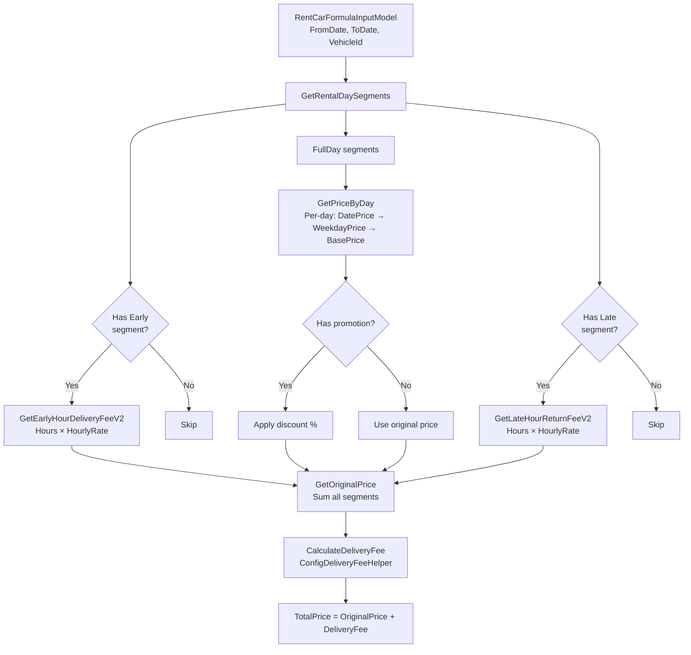

# Helper Classes — Core Algorithms

> Document 6 helper classes quan trọng nhất trong hệ thống.
> Mỗi class: method signatures, logic flow step-by-step, constants, data models.

---

## Method Contract Summary

| # | Class | Method | Signature | Returns | Section |
|---|-------|--------|-----------|---------|---------|
| 1 | RentCarHelper | GetRentalHourStartEnd | `static (double, double) GetRentalHourStartEnd(Vehicle_RentalSetting, DateTime)` | (start, end) tuple | §1.2 |
| 2 | RentCarHelper | GetRentalDaySegments | `static RentCarSegmentModel[] GetRentalDaySegments(RentCarFormulaInputModel)` | Segment[] (Early/FullDay/Late) | §1.3 |
| 3 | RentCarHelper | GetEarlyHourDeliveryFeeV2 | `static async Task<RentCarSegment_PriceModel> GetEarlyHourDeliveryFeeV2(RentCarFormulaInputModel, DateTime, DateTime)` | Segment price + flags | §1.4 |
| 4 | RentCarHelper | GetLateHourReturnFeeV2 | `static async Task<RentCarSegment_PriceModel> GetLateHourReturnFeeV2(RentCarFormulaInputModel, DateTime, DateTime)` | Segment price + flags | §1.5 |
| 5 | RentCarHelper | GetOriginalPrice | `static async Task<RentCarOriginalPriceModel> GetOriginalPrice(RentCarFormulaInputModel)` | TotalOriginalPrice, Segments[] | §1.6 |
| 6 | RentCarHelper | GetPriceByDay | `static async Task<RentCarPriceByDayModel> GetPriceByDay(RentCarFormulaInputModel)` | SubTotal, PriceByDay, Promotion | §1.7 |
| 7 | RentCarHelper | BuildPriceModel | `static void BuildPriceModel(Dict<int, WeekdayPrice>, Dict<string, decimal?>, RentCarSegment_PriceModel, DateTime?, decimal)` | Mutates segment | §1.8 |
| 8 | SearchingVehicleHelper | GetRentalServices_V2Async | `static async Task<(RentalService_SelfdriveCarRental[], Dict<string, DistanceItemResultModel>, string)>` | Filtered vehicles + distances | §2.1 |
| 9 | ConfigDeliveryFeeHelper | CalculateDeliveryFee | `static async Task<RentalFeeResult> CalculateDeliveryFee(ConfigDeliveryFeeArrJsonModel[], decimal, DateTime, DateTime, Vehicle_RentalSetting, RentCarServiceInfoModel, bool)` | RentalFeeResult | §3.2 |
| 10 | ConfigDeliveryFeeHelper | BuildByHourResult | `(internal)` | Price = hours × rate × 1000 | §3.3 |
| 11 | ConfigDeliveryFeeHelper | BuildByDayResult | `(internal)` | Price from BuildPriceModel × fraction | §3.4 |
| 12 | RentalServiceHelper | GetEndTime | `static DateTime GetEndTime(DateTime?, int?, int?, int?, int?)` | Deadline DateTime (UTC) | §4.1 |
| 13 | RentalServiceHelper | BuildDictPriceByDate | `static Dict<string, decimal?> BuildDictPriceByDate(DateTime?, DateTime?, ServiceItem_DateRentalPriceInfo[])` | Dict<"dd/MM/yyyy", price> | §4.2 |
| 14 | RentalServiceHelper | GetPlanProfitAndOwnerRemain | `(method)` | PlanProfitAmount, OwnerRemainAmount | §4.4 |
| 15 | PushNotificationHelper | PushNotify_SQLSP | `static async Task PushNotify_SQLSP()` | void (sends FCM, writes history) | §5.2 |
| 16 | WalletHelper | GetUserWalletPayment | `static Wallet GetUserWalletPayment(Guid?)` | Wallet entity | §6.2 |
| 17 | WalletHelper | GetUserWallets | `static Dict<Guid?, Wallet> GetUserWallets(Guid?[], string)` | Dict of wallets (auto-creates) | §6.3 |
| 18 | WalletHelper | FundingWallet | `static string FundingWallet(WalletFundingModel[], string)` | Error string (empty=OK) | §6.5 |
| 19 | WalletHelper | TransferWallet | `static string TransferWallet(WalletTransferModel[])` | Error string | §6.6 |
| 20 | WalletHelper | CreateWallet | `static WalletModel CreateWallet(Guid?, long?, out string)` | WalletModel + error | §6.7 |

---

## Mục lục
- [1. RentCarHelper — Pricing Engine](#1-rentcarhelper--pricing-engine)
- [2. SearchingVehicleHelper — Search Pipeline](#2-searchingvehiclehelper--search-pipeline)
- [3. ConfigDeliveryFeeHelper — Delivery Fee Rules](#3-configdeliveryfeehelper--delivery-fee-rules)
- [4. RentalServiceHelper — Timeout & Pricing Helpers](#4-rentalservicehelper--timeout--pricing-helpers)
- [5. PushNotificationHelper — FCM Pipeline](#5-pushnotificationhelper--fcm-pipeline)
- [6. WalletHelper — Wallet Operations](#6-wallethelper--wallet-operations)

---

## 1. RentCarHelper — Pricing Engine

**File:** `AllianceMiddlemanWebAPI.Service/Helper/RentCarHelper.cs`
**Namespace:** `AllianceMiddlemanWebAPI.Shared.Helper`
**Inherits:** `RentalServiceHelper`

### 1.1 Constants & Segment Codes

```csharp
public const string GetEarly = "GetEarly";           // Nhận xe sớm (trước giờ quy định)
public const string FullDay = "FullDay";              // Ngày thuê đầy đủ
public const string ReturnLate = "ReturnLate";        // Trả xe muộn (sau giờ quy định)
public const string PriceByDate = "PriceByDate";      // Giá theo ngày cụ thể
public const string PriceByWeekDay = "PriceByWeekDay"; // Giá theo thứ trong tuần
public const string PriceByHours = "PriceByHours";    // Giá theo giờ

public const int NumOfHourToBeOneDay = 12;  // ≥12 giờ → tính 1 ngày đầy đủ
```

### 1.2 GetRentalHourStartEnd() — 24H vs Business Hours

```csharp
public static (double, double) GetRentalHourStartEnd(
    Vehicle_RentalSetting setting, DateTime fromDate)
```

**Logic:**
1. Nếu `RentalHour_Using24Hours == true`:
   - `rentalHourStart = fromDate.Hour + (fromDate.Minute / 60.0)` (giờ thực tế nhận xe)
   - `rentalHourEnd = rentalHourStart`
2. Ngược lại (business hours):
   - `rentalHourStart = setting.RentalHourStart ?? 0` (ví dụ: 8.0)
   - `rentalHourEnd = setting.RentalHourEnd ?? 0` (ví dụ: 20.0)
3. Return `(rentalHourStart, rentalHourEnd)`

### 1.3 GetRentalDaySegments() — Tách rental thành segments

```csharp
public static RentCarSegmentModel[] GetRentalDaySegments(RentCarFormulaInputModel model)
```

**Input:** `RentCarFormulaInputModel` chứa `ServiceInfo` (xe, setting) và `RentInfo` (FromDate, ToDate)

**Logic flow (step-by-step):**

```
Step 1: Lấy rentalHourStart, rentalHourEnd từ GetRentalHourStartEnd()
        hourToAdd = 24 + rentalHourEnd - rentalHourStart

Step 2: Normalize pickup time
        fromC = thời điểm nhận xe thực tế (client time)
        fromO = ngày nhận xe + rentalHourStart (giờ quy định)
        Nếu fromC > fromO → dịch fromO lên 24 tiếng

Step 3: Tạo Early segment (nếu fromC < fromO)
        → {Code: "GetEarly", FromDate: fromC, ToDate: fromO, NumOfDay: 0}

Step 4: Normalize return time
        toC = thời điểm trả xe thực tế (client time)
        toO = ngày trả xe + rentalHourEnd (giờ quy định)
        Nếu toO > toC VÀ toO - 24h >= fromC → dịch toO lùi 24 tiếng

Step 5: Tạo FullDay segments (loop fromO → toO)
        Mỗi ngày: {Code: "FullDay", FromDate: date, ToDate: date+1day, NumOfDay: 1}

Step 6: Kiểm tra có thể thêm ReturnLate không
        canAddReturnLate = true nếu fromO <= toO

Step 7: Tạo Late segment (nếu toO < toC)
        → {Code: "ReturnLate", FromDate: toO, ToDate: toC, NumOfDay: 0}

Step 8: Filter → chỉ giữ segments có FromDate < ToDate
```

**Ví dụ minh hoạ:**
```
Setting: RentalHourStart=8h, RentalHourEnd=20h
Thuê: 01/03 06:00 → 03/03 22:00

Segments:
  1. GetEarly:   01/03 06:00 → 01/03 08:00 (2 tiếng sớm)
  2. FullDay:    01/03 08:00 → 02/03 08:00 (ngày 1)
  3. FullDay:    02/03 08:00 → 03/03 08:00 (ngày 2)
  4. ReturnLate: 03/03 20:00 → 03/03 22:00 (2 tiếng muộn)
```

### 1.4 GetEarlyHourDeliveryFeeV2() — Phí nhận xe sớm

```csharp
public static async Task<RentCarSegment_PriceModel> GetEarlyHourDeliveryFeeV2(
    RentCarFormulaInputModel model, DateTime fromDate, DateTime toDate)
```

**Logic flow:**
```
Step 1: Tính hours = (toDate - fromDate).TotalHours

Step 2: Query ConfigDeliveryFee với code = EARLY_CAR_DELIVERY_FEE
        Gọi DeliveryFeeHelper.CalculateDeliveryFee(earlyFees, hours, ...)

Step 3: Nếu có feeResult (V2 — configurable):
        → Price = feeResult.Price
        → ServiceFee = feeResult.ServiceFee
        → IsFullDay / IsHalfDay từ feeResult

Step 4: Nếu không có config (V1 — fallback):
        Nếu hours >= 12 HOẶC hours > setting.NumOfEarlyHourToBeOneDay:
          → Tính giá 1 ngày đầy đủ (lookup dictPriceByDate/dictPriceByWeekDay)
          → IsFullDay = true
        Ngược lại:
          → Price = hours × setting.EarlyHourDeliveryFee × 1000
          → PriceInfo = "PriceByHours"
```

### 1.5 GetLateHourReturnFeeV2() — Phí trả xe muộn

```csharp
public static async Task<RentCarSegment_PriceModel> GetLateHourReturnFeeV2(
    RentCarFormulaInputModel model, DateTime fromDate, DateTime toDate)
```

**Logic:** Tương tự `GetEarlyHourDeliveryFeeV2()` nhưng:
- ConfigDeliveryFee code = `LATE_CAR_DELIVERY_FEE`
- Dùng `setting.LateHourReturnFee` cho fallback V1
- Dùng `setting.NumOfLateHourToBeOneDay` cho ngưỡng

### 1.6 GetOriginalPrice() — Orchestrator tính giá gốc

```csharp
public static async Task<RentCarOriginalPriceModel> GetOriginalPrice(RentCarFormulaInputModel model)
```

**Logic flow (step-by-step):**

```
Step 1: Gọi GetRentalDaySegments() → tách thành early/fullday/late

Step 2: Build 2 price dictionaries:
        dictPriceByDate:    Dict<string, decimal?>  // "dd/MM/yyyy" → giá
        dictPriceByWeekDay: Dict<int, ServiceItem_WeekdayRentalPriceInfo>  // DayOfWeek → giá

Step 3: Tính giá Early segment (nếu có):
        → GetEarlyHourDeliveryFeeV2()
        → Nếu IsFullDay: rentalDayCount++
        → hasOneDayEarly / hasHalfDayEarly flag

Step 4: Tính giá mỗi FullDay segment:
        → Mỗi ngày: BuildPriceModel(dictPriceByWeekDay, dictPriceByDate, date)
          Ưu tiên: PriceByDate > PriceByWeekDay
        → Cộng ServiceFee nếu có ServiceFeePercentOnByDate
        → rentalDayCount += NumOfFullDay

Step 5: Tính giá Late segment (nếu có):
        → GetLateHourReturnFeeV2()
        → Nếu IsFullDay: rentalDayCount++
        → hasOneDayLate / hasHalfDayLate flag

Step 6: Điều chỉnh rentalDayCount:
        Nếu hasHalfDayLate VÀ hasHalfDayEarly: rentalDayCount += 1 (gộp 2 nửa ngày)
        Nếu rentalDayCount == 0: rentalDayCount = 1 (tối thiểu 1 ngày)

Step 7: Tổng hợp:
        TotalOriginalPrice = tổng giá tất cả segments
        OriginalPriceByDay = TotalOriginalPrice / rentalDayCount
        ServiceFee = tổng service fee (chỉ full/half days)
```

**Return:** `RentCarOriginalPriceModel`
```
{
  TotalOriginalPrice: decimal?,     // Tổng trước giảm giá
  RentalDayCount: int?,             // Số ngày thuê
  OriginalPriceByDay: decimal?,     // Giá gốc/ngày
  ServiceFee: decimal?,             // Tổng phí dịch vụ
  Segments: RentCarSegment_PriceModel[]  // Chi tiết từng segment
}
```

### 1.7 GetPriceByDay() — Áp dụng multiday discount

```csharp
public static async Task<RentCarPriceByDayModel> GetPriceByDay(RentCarFormulaInputModel model)
```

**Logic flow:**
```
Step 1: Gọi GetOriginalPrice() → lấy giá gốc

Step 2: Áp dụng multiday discount (nếu HaveMultidayRentalDiscount == true):
        - Kiểm tra IgnoreMultidayRentalDiscount_InMinimumRentalDayRequired
        - Loop MultiRentDayDiscounts: tìm discount có NumOfMinDay <= rentalDayCount
        - Chọn discount có DiscountPercent cao nhất
        - totalPromotionMoney = TotalOriginalPrice × discountPercent / 100

Step 3: Áp dụng voucher (nếu ShowDiscountInSearch == true):
        - Tìm default DiscountCode
        - GetDiscountMoney(totalPrice, code)
        - Cập nhật SubTotal

Step 4: Tính final pricing:
        SubTotal = TotalOriginalPrice - totalPromotionMoney
        PriceByDay = SubTotal / rentalDayCount
        PromotionMoneyByDay = totalPromotionMoney / rentalDayCount
```

**Return:** `RentCarPriceByDayModel` (extends RentCarOriginalPriceModel)
```
{
  ...inherited...,
  SubTotal: decimal?,              // Sau giảm giá
  TotalPromotionMoney: decimal?,   // Tổng giảm
  PriceByDay: decimal?,            // Giá/ngày cuối cùng
  PromotionMoneyByDay: decimal?,   // Giảm/ngày
  PromotionNote: string,           // "NumOfMinDay X. Discount Y%"
  PromotionNumOfMinDay: int?       // Ngày tối thiểu
}
```

### 1.8 End-to-End Pricing Example

**Scenario:** Thuê xe 3 ngày, nhận sớm 2 tiếng, trả muộn 4 tiếng

**Setting:** RentalHourStart=8h, RentalHourEnd=20h, EarlyHourDeliveryFee=30 (×1000=30,000 VNĐ/h)
**Giá:** WeekdayPrice=800,000 VNĐ/ngày, LateHourReturnFee=30 (×1000=30,000 VNĐ/h)
**Multiday discount:** Thuê ≥3 ngày = 5%

```
Input:  01/03 06:00 → 03/03 22:00 (client time, 3 ngày)

Step 1: GetRentalDaySegments()
  rentalHourStart = 8h, rentalHourEnd = 20h
  fromC = 01/03 06:00 (nhận thực tế)
  fromO = 01/03 08:00 (giờ quy định)   → fromC < fromO → có Early segment
  toC   = 03/03 22:00 (trả thực tế)
  toO   = 03/03 20:00 (giờ quy định)   → toO < toC → có Late segment

  Segments output:
    1. GetEarly:    01/03 06:00 → 01/03 08:00  (2h sớm, NumOfDay=0)
    2. FullDay:     01/03 08:00 → 02/03 08:00  (ngày 1, NumOfDay=1)
    3. FullDay:     02/03 08:00 → 03/03 08:00  (ngày 2, NumOfDay=1)
    — Loop dừng vì 03/03 08:00 + 24h = 04/03 08:00 > toO = 03/03 20:00
    — Khoảng 03/03 08:00 → 03/03 20:00 (12h) = 1 FullDay nữa? KHÔNG.
    — FullDay loop chỉ thêm khi next date ≤ toO. 03/03 08:00+24h > 03/03 20:00 → dừng.
    — Nhưng 03/03 08:00 → 03/03 20:00 tạo FullDay ngày 3 vì nó nằm trong range.
    4. FullDay:     03/03 08:00 → 03/03 20:00  (ngày 3, NumOfDay=1) — partial FullDay
    5. ReturnLate:  03/03 20:00 → 03/03 22:00  (2h muộn, NumOfDay=0)

  rentalDayCount ban đầu = 3 (từ 3 FullDay segments)

Step 2: Tính giá Early (2h)
  → ConfigDeliveryFee match: OrderNo=3 LessThan 3h → ByHour
  → Price = 2 × 30,000 = 60,000 VNĐ
  → IsFullDay=false, IsHalfDay=false
  → rentalDayCount vẫn = 3

Step 3: Tính giá FullDay (3 ngày)
  Ngày 1 (01/03, Sat): lookup dictPriceByWeekDay[Saturday] → 800,000
  Ngày 2 (02/03, Sun): lookup dictPriceByWeekDay[Sunday]   → 800,000
  Ngày 3 (03/03, Mon): lookup dictPriceByWeekDay[Monday]   → 800,000
  → Total FullDay = 2,400,000 VNĐ

Step 4: Tính giá Late (2h)
  → ConfigDeliveryFee match: OrderNo=3 LessThan 3h → ByHour
  → Price = 2 × 30,000 = 60,000 VNĐ
  → IsFullDay=false, IsHalfDay=false

Step 5: Tổng hợp
  TotalOriginalPrice = 60,000 + 2,400,000 + 60,000 = 2,520,000 VNĐ
  rentalDayCount = 3
  OriginalPriceByDay = 2,520,000 / 3 = 840,000 VNĐ

Step 6: Multiday discount (≥3 ngày, 5%)
  totalPromotionMoney = 2,520,000 × 5% = 126,000 VNĐ
  SubTotal = 2,520,000 - 126,000 = 2,394,000 VNĐ
  PriceByDay = 2,394,000 / 3 = 798,000 VNĐ
```

**Scenario 2:** Nhận sớm 5 tiếng (thay vì 2h)

```
Input:  01/03 03:00 → 03/03 22:00

Step 2: Tính giá Early (5h)
  → ConfigDeliveryFee match: OrderNo=1 LessThanOrEqual 9h → ByDay 1.0
  → Price = 800,000 VNĐ (1 ngày đầy đủ)
  → IsFullDay=true → rentalDayCount++ = 4

Step 5 revised:
  TotalOriginalPrice = 800,000 + 2,400,000 + 60,000 = 3,260,000 VNĐ
  rentalDayCount = 4 (3 fullday + 1 early full)
```

**Edge case: Half-day merge**

```
Nếu Early = IsHalfDay VÀ Late = IsHalfDay:
  → rentalDayCount += 1 (gộp 2 nửa ngày thành 1 ngày)
  → Ví dụ: Early 4h (0.5 day) + Late 4h (0.5 day) = +1 day

Nếu chỉ 1 trong 2 là HalfDay:
  → rentalDayCount += 0 (không gộp)
```

### 1.8 BuildPriceModel() — Lookup giá

```csharp
public static void BuildPriceModel(
    Dictionary<int, ServiceItem_WeekdayRentalPriceInfo> dictPriceByWeekDay,
    Dictionary<string, decimal?> dictPriceByDate,
    RentCarSegment_PriceModel m, DateTime? date, decimal days = 1)
```

**Ưu tiên:** PriceByDate (giá ngày cụ thể) > PriceByWeekDay (giá theo thứ)
- Nếu tìm thấy giá trong `dictPriceByDate` → dùng + cộng ServiceFeePercentOnByDate
- Fallback → dùng `dictPriceByWeekDay[date.DayOfWeek]`
- Set `PriceInfo` = "PriceByDate" hoặc "PriceByWeekDay - {DayOfWeek}"

### 1.9 Data Models

```csharp
// Segment model
public class RentCarSegmentModel {
    string Code;          // "GetEarly" | "FullDay" | "ReturnLate"
    DateTime FromDate;    // Bắt đầu segment
    DateTime ToDate;      // Kết thúc segment
    int? NumOfFullDay;    // Số ngày (0 cho early/late)
}

// Segment + price
public class RentCarSegment_PriceModel : RentCarSegmentModel {
    decimal? Price;        // Giá segment
    decimal? ServiceFee;   // Phí dịch vụ
    string PriceDate;      // Ngày dùng để tra giá
    string PriceInfo;      // Nguồn giá: "PriceByDate" | "PriceByWeekDay" | "PriceByHours"
    bool IsFullDay;        // Tính là 1 ngày đầy đủ
    bool IsHalfDay;        // Tính là nửa ngày
}
```

### 1.10 Vehicle_RentalSetting Properties Sử dụng

| Property | Type | Mô tả |
|----------|------|-------|
| RentalHour_Using24Hours | bool | Chế độ 24h (giờ nhận = giờ trả) |
| RentalHourStart | double? | Giờ bắt đầu business hours |
| RentalHourEnd | double? | Giờ kết thúc business hours |
| NumOfEarlyHourToBeOneDay | double? | Ngưỡng early → 1 ngày |
| NumOfLateHourToBeOneDay | double? | Ngưỡng late → 1 ngày |
| EarlyHourDeliveryFee | decimal? | Phí giao sớm/giờ (×1000 VNĐ) |
| LateHourReturnFee | decimal? | Phí trả muộn/giờ (×1000 VNĐ) |
| HaveMultidayRentalDiscount | bool | Bật giảm giá nhiều ngày |
| HaveDeliverySurcharge | bool | Có phụ thu giao xe |
| HaveInsurance | bool | Có bảo hiểm |

### 1.11 Vehicle_RentalSetting Full Schema (từ DB — 31 columns)

> **Lưu ý:** Bảng DB chứa 31 columns (bao gồm base fields). Một số fields trong C# model (như ServiceFeePercentOnByDate, MinimumRentalDayRequired, CompletionFeePercent...) KHÔNG nằm trong bảng này — chúng được lấy từ `RentalServiceCategorySetting` hoặc `SystemConfig` rồi merge vào model lúc runtime.

#### Columns chính (business logic)

| Column | Type | Mô tả |
|--------|------|-------|
| Id | bigint | PK |
| RentalServiceCategoryId | bigint | FK → ConfigRentalServiceCategory |
| RentalHourStart | integer | Giờ bắt đầu cho thuê (0-23, default 8) |
| RentalHourEnd | integer | Giờ kết thúc cho thuê (0-23, default 20) |
| RentalHour_Using24Hours | boolean | Chế độ 24h (bỏ qua RentalHourStart/End) |
| NumOfEarlyHourToBeOneDay | integer | Ngưỡng early tính 1 ngày (giờ) |
| NumOfLateHourToBeOneDay | integer | Ngưỡng late tính 1 ngày (giờ) |
| EarlyHourDeliveryFee | numeric | Phí nhận sớm/giờ (×1000 VNĐ) |
| LateHourReturnFee | numeric | Phí trả muộn/giờ (×1000 VNĐ) |
| HaveMultidayRentalDiscount | boolean | Có giảm giá nhiều ngày |
| HaveDeliverySurcharge | boolean | Có phụ thu giao xa |
| MaximumDeliveryMileage | numeric | Khoảng cách giao xe tối đa (km) |
| DeliverySurcharge | numeric | Phụ thu giao xa (VNĐ hoặc VNĐ/km) |
| FreeDeliveryMileage | numeric | Km giao xe miễn phí |
| HaveExcessMileageSurcharge | boolean | Có phụ thu vượt km |
| MaximumMileage | numeric | Giới hạn km/ngày |
| ExcessMileageSurcharge | numeric | Phí vượt km (VNĐ/km) |
| HaveInsurance | boolean | Có bảo hiểm |
| HaveSecurity | boolean | Có thiết bị an ninh |
| HaveCleaningFee | boolean | Có phí vệ sinh |
| CleaningFee | numeric | Phí vệ sinh (VNĐ) |
| DeodorizingFee | numeric | Phí khử mùi (VNĐ) |
| ChargingFee | numeric | Phí sạc (VNĐ, xe điện) |

#### Base fields (kế thừa từ EzyBaseEntity)

| Column | Type | Mô tả |
|--------|------|-------|
| IsDeleted | boolean | Soft delete |
| Log_CreatedDate | timestamptz | Ngày tạo |
| Log_CreatedBy | varchar | Người tạo |
| Log_UpdatedDate | timestamptz | Ngày cập nhật |
| Log_UpdatedBy | varchar | Người cập nhật |
| Note | varchar | Ghi chú |
| OrderNo | numeric | Thứ tự |
| IsDisable | boolean | Vô hiệu |

#### Fields từ config (merge vào model lúc runtime, KHÔNG nằm trong DB table)

| C# Model Field | Nguồn | Mô tả |
|----------------|-------|-------|
| ServiceFeePercentOnByDate | `ConfigRentalServiceCategory.SettingJson` | % phí dịch vụ trên giá theo ngày |
| MinimumRentalDayRequired | `ConfigRentalServiceCategory.SettingJson` | Số ngày thuê tối thiểu |
| IgnoreMultidayRentalDiscount_InMinimumRentalDayRequired | `ConfigRentalServiceCategory.SettingJson` | Bỏ qua discount cho minimum day |
| CompletionFeePercent | `RENTAL_SERVICE_SETTING` SystemConfig | % phí hoàn thành (override system) |
| WithholdingTaxPercent | `RENTAL_SERVICE_SETTING` SystemConfig | % thuế TNCN |
| OverLimitFeePerKm | Alias of `ExcessMileageSurcharge` | Phí vượt km (tên cũ trong code) |
| LimitKmPerDay | Alias of `MaximumMileage` | Giới hạn km/ngày (tên cũ trong code) |

---

## 2. SearchingVehicleHelper — Search Pipeline

**Files:**
- `AllianceMiddlemanWebAPI.Service/Helper/SearchingVehicleHelper.cs`
- `AllianceMiddlemanWebAPI.Service/Helper/SearchingVehicleHelper_Ext.cs`

### 2.1 GetRentalServices_SelfdriveCar_Version2Async() — Main Entry

```csharp
public static async Task<(
    RentalService_SelfdriveCarRental[] data,
    Dictionary<string, DistanceItemResultModel> dictSearching_Distance,
    string error
)> GetRentalServices_SelfdriveCar_Version2Async(
    RentalService_SelfdriveCarRentalBaseParamModel param,
    RentalServiceCategorySettingJsonModel settingJson)
```

### 2.2 Pipeline 6 phases

```
┌─────────────────────────────────────────────────────────┐
│ Phase 1: Location Filtering (SP bounding box)           │
│   → Dict<long?, HostAddress> hostAddresses              │
├─────────────────────────────────────────────────────────┤
│ Phase 2: DB Query (approved + active + not suspended)   │
│   → long[] rentalServiceIds                             │
├─────────────────────────────────────────────────────────┤
│ Phase 3: Attribute Filtering (14 filter types)          │
│   → filtered RentalService_SelfdriveCarRental[]         │
├─────────────────────────────────────────────────────────┤
│ Phase 4: Availability Checks (3 levels + insurance)     │
│   → available RentalService_SelfdriveCarRental[]        │
├─────────────────────────────────────────────────────────┤
│ Phase 5: Distance Calculation (Google Distance Matrix)  │
│   → Dict<string, DistanceItemResultModel>               │
├─────────────────────────────────────────────────────────┤
│ Phase 6: Distance Filtering (max delivery mileage)      │
│   → final RentalService_SelfdriveCarRental[]            │
└─────────────────────────────────────────────────────────┘
```

### Phase 1: Location Filtering

**Method:** `GetDictHostAddressAsync()`

```
IF có ProvinceId/DistrictId/WardId:
  → CaseRunning = 1 (tìm theo tên hành chính)
  → pStore.Province/District/Ward = tên từ cache

ELIF có Latitude/Longitude:
  → CaseRunning = 2 (bounding box)
  → Tính bounding box: DistanceMatrixHelper.GetBoundingBox(center, maxDistance)
  → pStore.SW_Lat/NE_Lat/SW_Lng/NE_Lng

→ Gọi sp_GetHostAddressForSearch_Json
→ Build Dict<long?, HostAddress> theo HostAddress.Id
```

**Settings:** MaxDistance = 30km (default), MaxVehicleCount = 20

### Phase 2: DB Query

```csharp
query.Where(c =>
    c.IsApproved == true &&    // Đã duyệt
    !c.IsAddNew &&             // Không phải mới tạo
    !c.IsSuspended &&          // Không bị đình chỉ
    !c.IsDeactive              // Không bị tắt
);

// Filter theo hostAddressIds từ Phase 1
// Include: Vehicle_RentalSetting, VehicleMultidayRentalDiscount_Detail, Vehicle

// Quick order: loại xe của chính renter
if (param.IsFromQuickOrder)
    query = query.Where(c => c.OwnerId != renterId);
```

### Phase 3: Attribute Filtering — 14 Filter Types

**Method:** `SearchRentalService_Filter<TParam>()`

| # | Filter | Parameter | Logic |
|---|--------|-----------|-------|
| 1 | Số chỗ ngồi | VehicleNoOfSeatIds[] | `Vehicle.VehicleNoOfSeatId IN (ids)` |
| 2 | Hộp số | VehicleTransmissionTypeIds[] | `Vehicle.VehicleTransmissionTypeId IN (ids)` |
| 3 | Phân khúc | VehicleSegmentIds[] | Lookup ConfigVehicleModel → filter VehicleModelId |
| 4 | Hãng xe | VehicleMakeIds[] | `Vehicle.VehicleMakeId IN (ids)` |
| 5 | Model xe | VehicleModelIds[] | `Vehicle.VehicleModelId IN (ids)` |
| 6 | Năm sản xuất | YearModels[] | `Vehicle.YearModel IN (years)` |
| 7 | Màu xe | VehicleColorIds[] | `Vehicle.VehicleColorId IN (ids)` |
| 8 | Nhiên liệu | FuelTypeIds[] | `Vehicle.FuelTypeId IN (ids)` |
| 9 | Giấy tờ/Yêu cầu | DocumentIds[], RentalRequiredItemIds[] | Lookup ServiceItem_RentalRequiredItem_Mapping |
| 10 | Tính năng xe | FeatureIds[] | ALL features phải match (intersection) |
| 11 | Loại xe phụ | VehicleTypeSubIds[] | `Vehicle.VehicleTypeSubId IN (ids)` |
| 12 | Năm min/max | VehicleMinYearModel, VehicleMaxYearModel | Range filter |
| 13 | An ninh | IsHaveSecurity | `Vehicle_RentalSetting.HaveSecurity` |
| 14 | Xe điện/AT/MT | IsElectricEngine, IsAutoTransmission, IsManualTransmission | Lookup ConfigVehicleFuelType/TransmissionType by Code |

> **Lưu ý:** Tất cả multi-value filters bỏ qua nếu chứa "ALL".
> Filter #10 (Features) yêu cầu TẤT CẢ features phải match (AND logic), các filter khác dùng OR logic.

### Phase 4: Availability Checks

**Method:** `CheckRentalServiceNotBusy()` — 4 sub-checks:

```
Sub-check 1: ServiceItem_BookedRentalSchedule
  → Loại xe có booking trùng date range (IsBooked == true)
  → Convert to UTC trước khi so sánh

Sub-check 2: ServiceItem_WeekdaysBusyRentalSchedule
  → Loại xe có ngày bận trùng thứ trong tuần (IsBusy == true)
  → Check mỗi ngày thuê: DayOfWeek có trong weekDays bận không

Sub-check 3: ServiceItem_DateBusyRentalSchedule
  → Loại xe có ngày bận cụ thể trùng date range (IsBusy == true)

Sub-check 4: ServiceItem_WeekdayRentalPrice
  → Loại xe không có giá > 0 cho bất kỳ ngày nào
```

**Method:** `CheckRentalServiceInsurance()`:
```
Nếu IsIgnoreInsuranceValidCheck == false:
  → Tìm xe có HaveInsurance == true
  → Load Vehicle_InsuranceInformation
  → Check: IsVerified && CoverageStartDate <= fromDateUTC && toDateUTC <= CoverageEndDate
  → Loại xe không đủ bảo hiểm
```

### Phase 4 — Worked Example: Availability Check

```
Xe A (Id=100) có dữ liệu:
  BookedRentalSchedule:
    - Booking #1: 05/03 00:00 UTC → 08/03 00:00 UTC (IsBooked=true)
  WeekdaysBusyRentalSchedule:
    - Wednesday: IsBusy=true
  DateBusyRentalSchedule:
    - 15/03 → 17/03 (IsBusy=true)

Renter muốn thuê: 04/03 10:00 → 07/03 10:00 (UTC)

Sub-check 1 (Booked overlap):
  Booking #1: FromDate=05/03 00:00, ToDate=08/03 00:00
  → Case 1: 05/03 00:00 <= 04/03 10:00 <= 08/03 00:00? → KHÔNG (04/03 < 05/03)
  → Case 2: 05/03 00:00 <= 07/03 10:00 <= 08/03 00:00? → CÓ
  → Kết quả: BUSY (overlap case 2) → loại xe A

Renter muốn thuê: 10/03 08:00 → 12/03 08:00 (UTC)

Sub-check 1: Không overlap → OK
Sub-check 2 (Weekday busy):
  10/03 = Monday → OK
  11/03 = Tuesday → OK
  12/03 = Wednesday → IsBusy=true → BUSY
  → Kết quả: BUSY (Wednesday) → loại xe A

Renter muốn thuê: 10/03 08:00 → 11/03 20:00 (UTC, Mon-Tue only)

Sub-check 1: OK (no overlap)
Sub-check 2: Mon=OK, Tue=OK → OK
Sub-check 3: 10/03-11/03 không overlap 15/03-17/03 → OK
Sub-check 4: WeekdayRentalPrice[Mon] > 0 VÀ [Tue] > 0 → OK
→ Kết quả: AVAILABLE

⚠️ Overlap boundary: FromDate == booking.ToDate → CÓ overlap (inclusive)
   Ví dụ: Thuê 08/03 00:00 → 09/03 00:00, booking ends 08/03 00:00
   → Case 1: 05/03 00:00 <= 08/03 00:00 <= 08/03 00:00 → CÓ → BUSY
```

### Phase 5: Distance Calculation

```
Build list (lat, lng) cho mỗi rental.HostAddress
→ DistanceMatrixHelper.GetDistanceMultiAsync(center, destinations)
→ Build Dict<"Lat_Lng", DistanceItemResultModel>
→ Assign distance vào mỗi rental.Distance
```

### Phase 6: Distance Filtering

```
Loại xe có Distance < 0 (lỗi tính khoảng cách)
Nếu IsFromQuickOrder VÀ IsHaveDeliverySurcharge:
  → Loại xe có Distance > MaximumDeliveryMileage × 1000
```

---

## 3. ConfigDeliveryFeeHelper — Delivery Fee Rules

**File:** `AllianceMiddlemanWebAPI.Service/Helper/ConfigDeliveryFeeHelper.cs`

### 3.1 Operator Types (10 loại)

| Operator | Logic | Ví dụ |
|----------|-------|-------|
| LessThan | first < hours | 0 < 3 giờ |
| LessThanOrEqual | first ≤ hours | 0 ≤ 3 giờ |
| Equal | first == hours | 12 == 12 giờ |
| NotEqual | first ≠ hours | 0 ≠ 3 giờ |
| GreaterThan | first > hours | 12 > 3 giờ |
| GreaterThanOrEqual | first ≥ hours | 12 ≥ 3 giờ |
| InRangeExclusive | f < hours < s | 0 < 3 < 6 |
| InRangeInclusiveStart | f ≤ hours < s | 0 ≤ 3 < 6 |
| InRangeInclusiveEnd | f < hours ≤ s | 0 < 3 ≤ 6 |
| InRangeInclusiveBoth | f ≤ hours ≤ s | 0 ≤ 3 ≤ 6 |

### 3.2 CalculateDeliveryFee()

```csharp
public static async Task<RentalFeeResult> CalculateDeliveryFee(
    ConfigDeliveryFeeArrJsonModel[] configArr,
    decimal hours, DateTime fromDate, DateTime toDate,
    Vehicle_RentalSetting setting, RentCarServiceInfoModel serviceInfo,
    bool isEarlyDelivery)
```

**Logic:**
```
1. Validate: hours < 0 hoặc configArr null → return null
2. Sort configArr theo OrderNo (ascending)
3. Mỗi config:
   a. Parse Operator → OperatorType enum
   b. Parse ChargeType → ChargeType enum
   c. Gọi IsConditionMatched(operator, hours, firstValue, secondValue)
   d. Nếu match:
      - ChargeType.ByHour → BuildByHourResult()
      - ChargeType.ByDay  → BuildByDayResult()
   e. Return kết quả đầu tiên match (short-circuit)
4. Không match → return null
```

**Quy tắc: first match wins** — config có OrderNo thấp nhất match trước.

### 3.5 Actual ConfigDeliveryFee Data (từ DB)

**Parent records (2):**

| Id | Code | Mô tả |
|----|------|-------|
| 1 | `EARLY_CAR_DELIVERY_FEE` | Phí nhận xe sớm |
| 2 | `LATE_CAR_DELIVERY_FEE` | Phí trả xe muộn |

**Children — EARLY_CAR_DELIVERY_FEE (ParentId=1):**

| OrderNo | Operator | FirstValue | SecondValue | ChargeType | Value | Ý nghĩa |
|---------|----------|------------|-------------|------------|-------|---------|
| 1 | LessThanOrEqual | 9 | — | ByDay | 1.0 | ≤9h → tính 1 ngày |
| 2 | InRangeInclusiveStart | 3 | 9 | ByDay | 0.5 | 3h ≤ x < 9h → tính 0.5 ngày |
| 3 | LessThan | 3 | — | ByHour | — | <3h → tính theo giờ |

**Children — LATE_CAR_DELIVERY_FEE (ParentId=2):**

| OrderNo | Operator | FirstValue | SecondValue | ChargeType | Value | Ý nghĩa |
|---------|----------|------------|-------------|------------|-------|---------|
| 1 | LessThanOrEqual | 15 | — | ByDay | 1.0 | ≤15h → tính 1 ngày |
| 2 | InRangeInclusiveStart | 3 | 15 | ByDay | 0.5 | 3h ≤ x < 15h → tính 0.5 ngày |
| 3 | LessThan | 3 | — | ByHour | — | <3h → tính theo giờ |

**⚠️ Lưu ý thứ tự match:** OrderNo=1 match trước, nên:
- Early 2 tiếng → match OrderNo=3 (LessThan 3) → ByHour
- Early 5 tiếng → match OrderNo=1 (LessThanOrEqual 9) → ByDay 1.0 ngày *(KHÔNG phải 0.5 ngày!)*
- Nguyên nhân: OrderNo=1 `LessThanOrEqual 9` match trước OrderNo=2 `InRangeInclusiveStart 3-9`
- Thực tế OrderNo=2 sẽ **KHÔNG BAO GIỜ match** vì OrderNo=1 đã bắt hết case ≤9h

### 3.3 BuildByHourResult()

```
Chọn ngày tham chiếu:
  - Early delivery → fromDate
  - Late return → toDate

Chọn phí/giờ:
  - Early → setting.EarlyHourDeliveryFee
  - Late → setting.LateHourReturnFee

Price = hours × hourDeliveryFee × 1000
PriceInfo = "PriceByHours"
IsFullDay = false, IsHalfDay = false
```

### 3.4 BuildByDayResult()

```
1. Xác định ngày tính giá (điều chỉnh theo rentalHourStart/End):
   - Early delivery, khác ngày: có thể +1 ngày
   - Early delivery, cùng ngày: có thể -1 ngày
   - Late return: có thể +1 ngày

2. Nếu child.Value == 1 (full day):
   → BuildPriceModel() với 1 ngày → IsFullDay=true

3. Nếu child.Value != 1 (half day, fraction):
   → BuildPriceModel() với child.Value (default 0.5)
   → IsHalfDay=true
```

---

## 4. RentalServiceHelper — Timeout & Pricing Helpers

**File:** `AllianceMiddlemanWebAPI.Service/Helper/RentalServiceHelper.cs`

### 4.1 GetEndTime() — Deadline trong business hours

> **Business hours:** Cấu hình dynamic qua `RentalServiceHelper.GetSettingJson()` — admin có thể thay đổi qua config. Mặc định: 7:00-21:00 VN time.

```csharp
public static DateTime GetEndTime(DateTime? now, int? businessHourStart,
    int? businessHourEnd, int? UI_TimezoneOffset, int? hour)
```

**Logic:**
```
1. Nếu now == null → now = UtcNow - UI_TimezoneOffset (→ client time)
2. start = date + businessHourStart (default 7h)
   end = date + businessHourEnd (default 21h)
3. Nếu now < start → now = start
4. result = now + hour (default 3h)
5. Nếu result > end:
   → result = now + 24h + businessHourStart - businessHourEnd + hour
   (= sang ngày hôm sau, bắt đầu từ business hours)
6. Chuyển lại UTC: result + UI_TimezoneOffset
```

**Ví dụ:**
```
now = 19:00, businessHours = 7:00-21:00, hour = 3
result = 22:00 > 21:00
→ result = 19:00 + 24 + 7 - 21 + 3 = 19:00 + 13 = 08:00 ngày hôm sau
```

### 4.2 BuildDictPriceByDate() — Price lookup dictionary

```csharp
public static Dictionary<string, decimal?> BuildDictPriceByDate(
    DateTime? fromDate, DateTime? toDate, ServiceItem_DateRentalPriceInfo[] priceByDates)
```

**Logic:**
```
1. Convert UTC → VN time (+420 phút = +7h)
2. Mở rộng range: fromDate - 1 ngày, toDate + 1 ngày (boundary cases)
3. Loop mỗi ngày trong range:
   a. Tìm prices có FromDate ≤ date ≤ ToDate
   b. Lấy MAX(RentalPrice) nếu nhiều config trùng
   c. Thêm vào dict: key = "dd/MM/yyyy", value = price
4. Return dict
```

### 4.3 GetAppSetting() — App settings

```csharp
// Defaults:
{
  FromTimeAddHour: 1,        // Thêm 1h cho giờ nhận mặc định
  FromTimeMinHour: 0,        // Giờ nhận tối thiểu
  ToTimeAddHour: 2,          // Thêm 2h cho giờ trả mặc định
  ToTimeMinHour: 20,         // Giờ trả tối thiểu
  FromToDateSetDefault: false,
  FromDateAddDay: 0,         // Thêm ngày cho ngày nhận mặc định
  ToDateAddDay: 3            // Thêm 3 ngày cho ngày trả mặc định
}
```

### 4.4 Financial Methods

**GetCompletionFee()** — Phí hoàn thành theo priority cascade:
```
1. Rental service item specific %
2. Owner specific %
3. System default %
```

**GetPlanProfitAndOwnerRemain():**
```
PlanProfitAmount = SubTotal × CompletionFee% + ServiceFee - DiscountMoney
                   + DeliveryFee × CompletionFee%
OwnerRemainAmount = DepositAmount - PlanProfitAmount - InsuranceFee
OwnerWithholdingTax = (TotalPrice - DepositAmount + OwnerRemainAmount) × WithholdingTaxPercent%
OwnerRemainAmount -= OwnerWithholdingTax
```

### 4.5 Other Utility Methods

| Method | Mô tả |
|--------|-------|
| `GetRentalServiceRating()` | Rating: < 3 served → "Mới", else → score |
| `GetUserRating()` | User rating + completed count + rate count |
| `ConvertMToKM()` | 5000m → "5km", 500m → "500m" |
| `FormatMoneyDetail()` | 0 → "Miễn phí", else → formatted VNĐ |
| `CreateRandomCode()` | Random 6 ký tự A-Z0-9 |
| `GetReviewAt()` | "2 ngày trước", "1 tháng trước"... |
| `GetAddressDetailFromAddress_VietNam()` | Parse address string → Province/District/Ward |

---

## 5. PushNotificationHelper — FCM Pipeline

**File:** `AllianceMiddlemanWebAPI.Service/Helper/PushNotificationHelper.cs`

### 5.1 Pipeline Overview

```
PushNotify_SQLSP()
  ├─ sp_GetNotifyMessage4Push_Json → pending notifications
  ├─ DictNotifyMgsId (duplicate check)
  └─ PushNotify_SQLSP_Thread() (per NotifyMgsId)
       ├─ GetPushNotifyItem() → PushNotifyItem + TTL check
       ├─ SendPushNotification_REST_HTTP_V1Async() → FCM
       │    ├─ Primary setting
       │    └─ Fallback settings (on SENDER_ID_MISMATCH)
       └─ InsertMutilAsync() → PushNotificationHistory
```

### 5.2 PushNotify_SQLSP() — Main Entry

```csharp
public static async Task PushNotify_SQLSP()
```

**Logic:**
```
1. GetSetting() → FCM settings (JSON file path, URLs)
2. sp_GetNotifyMessage4Push_Json_Run() → notification items
3. Group by NotifyMgsId → Dictionary
4. Mỗi NotifyMgsId:
   a. Check DictNotifyMgsId.TryGetValue() → đã xử lý chưa?
   b. Nếu chưa: DictNotifyMgsId.AddOrUpdate()
   c. Gọi PushNotify_SQLSP_Thread(items)
   d. Error → GGNotifyHelper.SendMessageGGChat
```

### 5.3 TTL/Expiration Logic

**GetPushNotifyItem() TTL:**
```
Default TTL = 900 giây (15 phút)
Nếu ConfigPushNotify chứa "Expiration": dùng giá trị đó
canSend = (NotifyAt + TTL) > UtcNow
Nếu hết hạn → canSend = false → ghi history "Expiried message"
```

**SendPushNotification FCM TTL:**
```
Default TTL = 4500 giây (75 phút)
Nếu ConfigPushNotify chứa "Expiration": dùng giá trị đó
Android: ttl = "{value}s"
APNS: apns-expiration = Unix timestamp (UtcNow + TTL)
```

**Priority:**
```
Nếu ConfigPushNotify["Priority"] == true:
  → Android: priority = "high"
  → APNS: apns-priority = "10"
Ngược lại:
  → Android: priority = "normal"
  → APNS: apns-priority = "5"
```

### 5.4 Duplicate Prevention

```csharp
public readonly static ConcurrentDictionary<long, int> DictNotifyMgsId = new();
```

- **Key:** NotifyMgsId (long)
- **Value:** Số items cho notification đó
- **Add:** Khi bắt đầu xử lý → `AddOrUpdate()`
- **Remove:** Sau khi insert history xong → `TryRemove()`
- **Check:** `TryGetValue()` trước khi xử lý → skip nếu đang xử lý

### 5.5 FCM Payload Structure

```json
{
  "message": {
    "token": "FCMTokenKey",
    "notification": { "title": "...", "body": "..." },
    "data": {
      "id": "notifyId", "action": "ORDER_CREATED",
      "msg_id": "...", "obj_id": "entityId", "obj_type": "entityName",
      "request_data": "{json}", "recipient_type": "Renter",
      "is_alert": "true",
      "alert": "{\"type\":\"action\",\"title\":\"...\",\"message\":\"...\"}"
    },
    "android": {
      "ttl": "4500s", "priority": "normal",
      "notification": { "channel_id": "...", "sound": "...", "tag": "id" }
    },
    "apns": {
      "headers": { "apns-priority": "5", "apns-expiration": "1234567890", "apns-collapse-id": "id" },
      "payload": { "aps": { "category": "NEW_MESSAGE_CATEGORY", "sound": "..." } }
    }
  }
}
```

### 5.6 History Recording

Mỗi notification attempt → 1 `PushNotificationHistoryModel`:

| Field | Mô tả |
|-------|-------|
| FCMTokenKey | Token đã gửi tới |
| UserLoginId | User nhận |
| NotifyMgsId | Message ID |
| ExecuteAt | Thời điểm thực thi |
| Note | "Action - Message" |
| Input | JSON payload đã gửi |
| IsSuccess | true/false |
| Message | FCM response hoặc "No response" hoặc "Expiried message" |

**Fallback:** Nếu `SENDER_ID_MISMATCH` → retry với `setting.SettingExts` (alternate FCM projects)

---

## 6. WalletHelper — Wallet Operations

**File:** `AllianceMiddlemanWebAPI.Service/Helper/WalletHelper.cs`

### 6.1 Constants

```csharp
public const string Wallet_PAYMENT = "PAYMENT";  // Ví thanh toán chính
public const string Wallet_SYSTEM = "SYSTEM";     // Ví hệ thống
public const string Wallet_COIN = "COIN";         // Ví coin/điểm thưởng
```

### 6.1.1 ConfigWalletType (từ DB)

| Code | Name | CurrencyCode | DailyLimit |
|------|------|-------------|------------|
| `PAYMENT` | Ví thanh toán | VND | 60,000,000 |
| `COIN` | Ví coin | COIN | — |

### 6.1.2 Wallet Entity (từ DB — 15 columns quan trọng)

| Column | Type | Mô tả |
|--------|------|-------|
| UserGuid | uuid | FK → UserLogin.ID_GUID |
| WalletTypeId | bigint | FK → ConfigWalletType |
| Balance | numeric | Số dư hiện tại |
| Status | varchar | Trạng thái ví |
| HashValue | varchar | Hash bảo mật (integrity check) |
| IsValid | boolean | Ví hợp lệ |

### 6.2 GetUserWalletPayment()

```csharp
public static Wallet GetUserWalletPayment(Guid? userGUID)
```

**Logic:** Tìm wallet có `UserGuid == userGUID` VÀ `WalletTypeId == PAYMENT type Id`

### 6.3 GetUserWallets() — Batch get + Auto-create

```csharp
public static Dictionary<Guid?, Wallet> GetUserWallets(
    Guid?[] userGUIDs, string walletTypeCode)
```

**Logic:**
```
1. Lấy WalletType từ cache theo code
2. Query DB: Wallet WHERE UserGuid IN (userGUIDs) AND WalletTypeId == type
3. Build Dict<Guid?, Wallet>
4. AUTO-CREATE: Nếu wallets.Length != userGUIDs.Length:
   → Mỗi user chưa có wallet:
     a. IWalletService.Add({ UserGuid, WalletTypeId })
     b. CopyProperties → Wallet entity
     c. Thêm vào dictionary
5. Return dictionary
```

### 6.4 Default Config (GetUserWalletSetting)

```csharp
{
  TopUpBankCode: "MBBANK",                    // Bank nạp tiền mặc định
  TopUpTransferContent: "NAP TIEN - #Phone#", // Nội dung chuyển khoản (#Phone# placeholder)
  AutoWithdrawBankCode: "MBBANK_WITHDRAW",    // Bank rút tự động
  WithdrawFee: 0,                             // Phí rút
  AutoWithdrawFee: 0,                         // Phí rút tự động
  MinMoneyCanWithdraw: 0                      // Số tiền tối thiểu rút
}
```

### 6.5 FundingWallet() — Nạp tiền ví

```csharp
public static string FundingWallet(WalletFundingModel[] models,
    string walletTypeCode = Wallet_PAYMENT)
```

**Logic:**
```
1. Mỗi model: resolve UserGUID từ UserId (nếu cần)
2. GetUserWallets() → lấy/tạo wallet
3. Mỗi model:
   a. Nếu wallet chưa có → IWalletService.Add()
   b. IWalletActionService.FundingRequest(walletId, amount, description)
   c. IWalletActionService.FundingApprove(requestId) → auto-approve
4. Return error message (empty = success)
```

### 6.6 TransferWallet() — Chuyển tiền giữa ví

```csharp
public static string TransferWallet(WalletTransferModel[] models)
```

**Logic:**
```
1. Mỗi model:
   a. IWalletActionService.TransferRequest(fromGUID, toGUID, money, description)
   b. IWalletActionService.TransferApprove(requestId)
   c. model.ResponseId = requestId
2. Error handling:
   → Lấy wallet info + user names
   → GGNotifyHelper.SendMessageGGChat_SystemReport() (báo lỗi qua Google Chat)
   → model.Error = error message
```

### 6.7 CreateWallet()

```csharp
public static WalletModel CreateWallet(Guid? userGUID, long? walletId, out string sMessage)
```

Tạo wallet mới cho user, return `WalletModel` + error message.

### 6.8 Wallet Edge Cases & Lưu ý quan trọng

| Scenario | Hành vi |
|----------|---------|
| **Insufficient balance** | `TransferRequest()` trả error string, model.Error được set, GGChat alert gửi |
| **Concurrent requests** | Dựa vào EF Core optimistic concurrency (xem chi tiết bên dưới) |
| **DailyLimit enforcement** | `ConfigWalletType.DailyLimit` (60M VND cho PAYMENT) — check tại `WalletActionService` trước khi approve |
| **HashValue integrity** | Wallet.HashValue = hash(Balance + WalletTypeId + UserGuid) — dùng để detect tampering. Nếu `IsValid = false` → wallet bị lock |
| **Auto-create on missing** | `GetUserWallets()` auto-creates wallet nếu user chưa có — đảm bảo mọi user luôn có wallet |
| **Request→Approve pattern** | Tất cả wallet operations (Funding, Transfer, Withdraw) đều 2 bước: Request → Approve. Trong code, Approve được gọi ngay sau Request (auto-approve). Pattern này cho phép future manual approval flow |

### 6.9 Concurrent Transfer — Chi tiết xử lý race condition

**Vấn đề:** Khi 2 request transfer cùng lúc cho 1 wallet, cả 2 đọc Balance cũ → cả 2 tính Balance mới → 1 trong 2 sai.

**Giải pháp: EF Core Optimistic Concurrency**

```
Request A: đọc Wallet (Balance = 1.000.000, LastTransactionGuid = guid-1)
Request B: đọc Wallet (Balance = 1.000.000, LastTransactionGuid = guid-1)

Request A: Transfer -500.000 → Balance = 500.000, LastTransactionGuid = guid-A
  → SaveChanges() OK (guid-1 match DB)
  → DB: Balance = 500.000, LastTransactionGuid = guid-A

Request B: Transfer -300.000 → Balance = 700.000, LastTransactionGuid = guid-B
  → SaveChanges() FAIL (guid-1 ≠ guid-A trong DB)
  → DbUpdateConcurrencyException
  → Application retry: đọc lại Balance = 500.000 → Transfer OK → Balance = 200.000
```

**Mechanism:** `LastTransactionGuid` đóng vai trò concurrency token. Mỗi transaction cập nhật guid mới. SaveChanges kiểm tra `WHERE LastTransactionGuid = @old_value` — nếu đã thay đổi → exception.

**Lưu ý:** Không có explicit DB lock (SELECT FOR UPDATE) — chỉ dùng optimistic concurrency. Phù hợp vì wallet transfers ít bị concurrent trên cùng 1 user (low contention).

---

## Pricing Calculation Flow — Mermaid



### Search Pipeline Flow — Mermaid

```mermaid
flowchart LR
    REQ[Search Request<br/>location, dates, filters]
    --> GEO[sp_GetHostAddressForSearch_Json<br/>Geo filter: bounding box + Haversine]
    --> HOSTS[HostAddress[] → Dict]

    HOSTS --> QUERY[EF Core Query<br/>RentalService_SelfdriveCarRental<br/>WHERE HostAddressId IN Dict.Keys]

    QUERY --> SCHED[Schedule Filter<br/>Exclude booked dates<br/>ServiceItem_BookedRentalSchedule]
    SCHED --> STATUS[Status Filter<br/>IsApproved, !IsSuspended<br/>!IsDeactive, !IsAddNew]
    STATUS --> PRICE_F[Price Filter<br/>Min/Max price range]
    PRICE_F --> SORT[Sort by distance<br/>or rating or price]
    SORT --> PAGE[Pagination<br/>Page × PageSize]
    PAGE --> RESULT[EzyDataSourceResult<br/>RentalServiceItemModel[]]
```

---

*Xem thêm: [stored-procedures.md](./stored-procedures.md) | [database-design.md](./database-design.md) | [pricing-calculation.md](../04_BUSINESS_FLOWS/pricing-calculation.md)*
