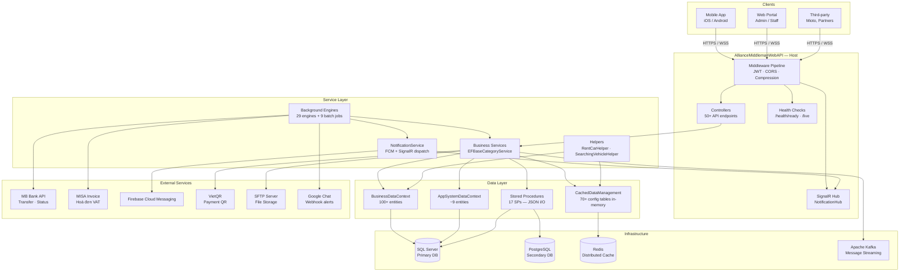

# Kiến trúc tổng quan — AllianceMiddleman (Sigo API)

## Mục lục
- [Mô tả hệ thống](#mô-tả-hệ-thống)
- [Cấu trúc thư mục source](#cấu-trúc-thư-mục-source)
- [Kiến trúc phân lớp](#kiến-trúc-phân-lớp)
- [Middleware pipeline](#middleware-pipeline)
- [Luồng xử lý request](#luồng-xử-lý-request)
- [Tech stack](#tech-stack)
- [Authentication & Authorization](#authentication--authorization)
- [External integrations](#external-integrations)
- [Health checks](#health-checks)

---

## Mô tả hệ thống

**AllianceMiddleman** (tên thương mại: **Sigo API**) là nền tảng backend cho dịch vụ cho thuê xe tự lái tại Việt Nam. Hệ thống đóng vai trò trung gian giữa chủ xe (Owner) và người thuê (Renter), xử lý toàn bộ vòng đời đơn hàng từ tìm kiếm xe, đặt chỗ, thanh toán, nhận/trả xe đến đánh giá.

**Đối tượng sử dụng:**
- **Renter (người thuê xe):** Tìm kiếm, đặt xe, thanh toán qua ứng dụng mobile
- **Owner (chủ xe):** Đăng ký dịch vụ, quản lý lịch, xác nhận đơn, nhận thanh toán
- **Admin/Staff:** Quản lý hệ thống qua web portal
- **Third-party:** Mioto, đối tác tích hợp API

**Production URL:** `https://api.sigo.vn`

---

## Cấu trúc thư mục source

```
SOURCE/
├── AllianceMiddleman_NetCore.sln             # Solution chính
│
├── AllianceMiddlemanWebAPI/                  # [Layer 1] Web API Host
│   ├── Program.cs                            # Entry point
│   ├── Startup.cs                            # DI, middleware config
│   ├── appsettings.json                      # Base config
│   ├── appsettings.Development.json          # Dev overrides
│   ├── appsettings.Production.json           # Prod overrides
│   ├── Controllers/
│   │   ├── AppSystem/                        # Account, Staff, Email, Notification
│   │   ├── MainBusiness/                     # Order, User, Vehicle, Payment
│   │   │   ├── MBBank/                       # MB Bank integration
│   │   │   ├── Mioto/                        # Mioto platform integration
│   │   │   ├── MisaInvoice/                  # MISA hoá đơn
│   │   │   ├── Sigo/                         # Core rental (RentalService, Searching)
│   │   │   └── VietQR/                       # VietQR payment
│   │   ├── Categories/                       # 50+ Config* controllers
│   │   │   └── HostedService/                # Background job management
│   │   └── Reports/                          # Báo cáo nghiệp vụ
│   └── Hubs/                                 # SignalR NotificationHub
│
├── AllianceMiddlemanWebAPI.Core/             # [Layer 3] Data Access Layer
│   └── Data/
│       ├── AppSystem/                        # System entities + AppSystemDataContext
│       │   └── Ext/                          # Partial classes
│       ├── BusinessData/                     # 100+ business entities + BusinessDataContext
│       │   └── Ext/                          # ~92 entity partial classes
│       └── Stores/                           # EEzyStoredProcedureNames.cs (14 SPs)
│
├── AllianceMiddlemanWebAPI.DataShared/       # [Layer 4] Shared DTOs
│
├── AllianceMiddlemanWebAPI.Service/          # [Layer 2] Business Logic
│   ├── Services/
│   │   ├── AppSystem/                        # Account, Staff, Device services
│   │   └── MainBusiness/                     # Core business services
│   ├── Engines/                              # 29+ background engines
│   │   └── BatchJobs/                        # 9 scheduled batch jobs
│   └── Hubs/                                 # SignalR hub implementations
│
├── Ezy.Module.EWallet/                       # Module: Ví điện tử
├── Ezy.Module.Identity/                      # Module: Xác thực, user identity
├── Ezy.Module.CMS/                           # Module: Quản lý nội dung
├── Ezy.Module.DynamicReport/                 # Module: Báo cáo động
├── Ezy.Module.TrafficTicket/                 # Module: Phạt nguội
├── Ezy.Module.Hotline/                       # Module: Hỗ trợ hotline
│
├── Libs/                                     # Compiled DLLs (60+ thư viện)
├── Script/                                   # Database migration scripts
├── Dockerfile                                # Multi-stage Docker build
└── Jenkinsfile                               # CI/CD pipeline
```

---

## Kiến trúc phân lớp

```
┌─────────────────────────────────────────────────────┐
│              Client (Mobile App / Web)               │
└───────────────────────┬─────────────────────────────┘
                        │ HTTPS / WSS
┌───────────────────────▼─────────────────────────────┐
│            AllianceMiddlemanWebAPI                   │
│   Controllers │ JWT Auth │ SignalR Hub │ Compression │
└───────────────────────┬─────────────────────────────┘
                        │
┌───────────────────────▼─────────────────────────────┐
│         AllianceMiddlemanWebAPI.Service              │
│      Business Logic │ Validation │ 29+ Engines       │
└───────────────────────┬─────────────────────────────┘
                        │
┌───────────────────────▼─────────────────────────────┐
│          AllianceMiddlemanWebAPI.Core                │
│     EF Core │ DbContext │ Stored Procedures          │
└──────────────┬──────────────────┬───────────────────┘
               │                  │
        SQL Server           PostgreSQL
               │
           Redis Cache
```

| Lớp | Project | Vai trò |
|-----|---------|---------|
| **API** | `AllianceMiddlemanWebAPI` | Nhận request, JWT auth, trả `EzyResultObject<T>` |
| **Service** | `AllianceMiddlemanWebAPI.Service` | Business logic, validation, background engines |
| **Data** | `AllianceMiddlemanWebAPI.Core` | EF Core queries, stored procedures |
| **Shared** | `AllianceMiddlemanWebAPI.DataShared` | DTOs dùng chung giữa layers |

---

## Middleware pipeline

Thứ tự middleware trong `Startup.Configure()`:

```
Request HTTP/HTTPS
        │
        ▼
[1] Developer Exception Page      ← Development only
        │
        ▼
[2] HTTPS Redirection              ← HTTP → HTTPS
        │
        ▼
[3] Static Files (multi-layer)     ← wwwroot, /home
        │
        ▼
[4] Response Compression           ← Gzip + Brotli
        │
        ▼
[5] Routing
        │
        ▼
[6] CORS                           ← AllowAnyOrigin + AllowCredentials
        │
        ▼
[7] Authentication                 ← JWT Bearer validate
        │
        ▼
[8] Authorization                  ← [Authorize] / [AllowAnonymous]
        │
        ▼
[9] Forwarded Headers              ← X-Forwarded-For, X-Forwarded-Proto
        │
        ▼
[10] Endpoints
     ├── MapControllers()
     ├── MapHub<NotificationHub>("/NotificationHub")
     ├── /health/ready → 200 | 503
     ├── /health/live  → 200 ALIVE
     └── /deployment   → assembly metadata + CommitHash
```

### Compression
| Algorithm | Điều kiện áp dụng |
|-----------|------------------|
| **Brotli** | Client hỗ trợ `Accept-Encoding: br` |
| **Gzip** | Client hỗ trợ `Accept-Encoding: gzip` |

### CORS
```
AllowAnyMethod + AllowAnyHeader + AllowAnyOrigin + AllowCredentials
```
> Phù hợp cho development/internal API. Cần restrict origins trên production nếu yêu cầu security cao hơn.

---

## Luồng xử lý request

### REST API Request
```
Client → HTTPS request
    │
    ▼
[JWT Middleware] ──── Token invalid? ──→ 401 Unauthorized
    │ Token valid
    ▼
[Controller]
    │ Deserialize + validate input
    ▼
[Service Layer]
    ├──▶ [BusinessDataContext / AppSystemDataContext]
    │         └──▶ SQL Server / PostgreSQL
    ├──▶ [Redis Cache]   ← Cache-aside pattern
    └──▶ [External API]  ← MB Bank, MISA, etc.
    │
    ▼
EzyResultObject<T>
    │
    ▼
[Response Compression] → Gzip / Brotli
    │
    ▼
Client ← JSON response
```

### SignalR (Real-time)
```
Client → WSS /NotificationHub?access_token=<jwt>
    │
    ▼
[OnMessageReceived] → Extract token from query string
    │
    ▼
[JWT Validation] → Validate token
    │
    ▼
[NotificationHub.OnConnectedAsync()] → Register connection
    │
    ▼
Server → Push notification → Client
```

### Response chuẩn `EzyResultObject<T>`
```json
{
  "Status": 1,
  "Message": "Thành công",
  "Data": { }
}
```

| Status | Ý nghĩa |
|--------|---------|
| `1` | Thành công |
| `0` | Lỗi nghiệp vụ |
| `-1` | Lỗi hệ thống |
| `-2` | Unauthorized / Forbidden |

---

## Tech stack

| Công nghệ | Phiên bản | Mục đích |
|-----------|-----------|---------|
| **ASP.NET Core** | 5.0 | Web API framework |
| **Entity Framework Core** | 5.0 | ORM (SQL Server + PostgreSQL providers) |
| **SQL Server** | — | Database chính (business + system data) |
| **PostgreSQL** | — | Database hỗ trợ (một số module) |
| **Redis** | 6+ | Distributed caching (StackExchange.Redis) |
| **Apache Kafka** | — | Message streaming (Confluent.Kafka) |
| **SignalR** | ASP.NET Core | Real-time WebSocket notification |
| **Docker** | — | Containerization (multi-stage build) |
| **Jenkins** | — | CI/CD pipeline |
| **EPPlus** | — | Excel export (NonCommercial license) |
| **Z.EntityFramework.Extensions** | — | EF Core bulk operations |
| **Newtonsoft.Json** | — | JSON serialization |

### Thư viện bổ sung (Libs/)
| Thư viện | Mục đích |
|----------|---------|
| `Ezy.APIService.*` | Internal utilities (Cache, Auth, Notification, SMS) |
| `RestSharp` | HTTP client cho external API calls |
| `HtmlAgilityPack` | HTML parsing |
| `EvoPdfToImage` | PDF → Image conversion |
| `DevExpressReport` | Advanced reporting |
| `Nito.AsyncEx` | Async utilities |
| `System.Linq.Dynamic.Core` | Dynamic LINQ queries |

---

## Authentication & Authorization

### JWT Bearer Token (chính)
```
POST /api/v1/Account/Login
    │ phone + password
    ▼
OAuth2 Server (http://localhost:12391/oauth2/token)
    │
    ▼
EzyLoginToken {
    access_token: "eyJ...",
    token_type: "Bearer",
    expires_in: 3600,
    refresh_token: "..."
}
    │
    ▼
Mỗi request tiếp theo:
    Header: Authorization: Bearer <access_token>
```

### JWT Configuration (`appsettings.json`)
```json
{
  "JwtSettings": {
    "SecretKey": "...",
    "Issuer": "SigoAPI",
    "Audience": "SigoClient",
    "ExpiresInMinutes": 60
  },
  "USER_AUTO_LOGIN_URL": "http://localhost:12391/oauth2/token"
}
```

### Token validation cho SignalR
JWT không thể truyền qua WebSocket header, nên token được truyền qua query string:
```
wss://api.sigo.vn/NotificationHub?access_token=<jwt>
```
Middleware `OnMessageReceived` extract token này và inject vào context.

### Authentication Flows
| Flow | Endpoint | Mô tả |
|------|---------|-------|
| Phone + Password | `POST /api/v1/Account/Login` | Đăng nhập thông thường |
| Google OAuth2 | `POST /api/v1/Account/LoginGoogle` | Đăng nhập bằng Google |
| OTP | `POST /api/v1/Account/GetOTP` → `POST /api/v1/Account/VerifyOTP` | Xác thực qua SMS |
| Logout | `POST /api/v1/Account/Logout` | Huỷ token |

### Endpoint Access Control
| Decorator | Ý nghĩa | Ví dụ |
|-----------|---------|-------|
| `[AllowAnonymous]` | Public, không cần token | GetOTP, HomePage |
| `[Authorize]` | Cần JWT hợp lệ | Mọi endpoint nghiệp vụ |

### Endpoints đặc biệt — bypass JWT error
Các endpoint sau cho phép access kể cả khi JWT invalid (trả data ẩn danh):
- `GET /api/v1/SearchingRentalService/GetSettingApp`
- `POST /api/v1/User/HomePage_Website`
- `POST /api/v2/User/HomePage_App`
- `POST /api/v1/User/HomePage_App`

---

## External integrations

| Service | Mục đích | Controller/Engine |
|---------|---------|-------------------|
| **MB Bank API** | Chuyển khoản tự động, đối soát giao dịch | `MBBank/`, `AutoWithdrawEngine` |
| **VietQR** | Tạo QR code thanh toán | `VietQR/` |
| **MISA Invoice** | Xuất hoá đơn VAT điện tử | `MisaInvoice/`, `AutoExportBillEngine` |
| **Mioto Platform** | Listing xe từ platform Mioto | `Mioto/` |
| **Google OAuth2** | Social login | `Account/LoginGoogle` |
| **Internal OAuth2** | Issue/validate JWT | `localhost:12391/oauth2/token` |
| **SFTP Server** | Lưu trữ file, ảnh | Config: `SFTP:*` |

---

## Health checks

Hệ thống expose 2 health check endpoints:

| Endpoint | Phương thức | Điều kiện trả 200 | Dùng cho |
|---------|------------|-------------------|---------|
| `/health/ready` | GET | `AppReadiness.IsReady == true` | Kubernetes readiness probe |
| `/health/live` | GET | Luôn trả `200 ALIVE` | Kubernetes liveness probe |

**Deployment info:**
```
GET /deployment
→ Trả về assembly metadata: version, CommitHash, build date
```

---

## System Architecture — Mermaid Diagram



---

## System Capabilities — Quick Reference

| Capability | Implementation | Key Files |
|-----------|---------------|-----------|
| **Vehicle Search** | Geo-based (Haversine) + schedule filter | `SearchingVehicleHelper`, `sp_GetHostAddressForSearch_Json` |
| **Order Lifecycle** | 10-state machine, auto-complete engine | `OrderService`, `AutoCompleteOrderEngine` |
| **Pricing Engine** | 14 formulas, day segments, promotions | `RentCarHelper`, `pricing-calculation.md` |
| **Payment** | Deposit → transfer → MB Bank auto-withdraw | `AutoWithdrawEngine`, `TransferMoneyEngine` |
| **Real-time Notification** | SignalR + FCM push + proactive scheduling | `NotificationService`, `PushNotificationEngine` |
| **CMS** | Blog, topic, landing page, SEO slug | `Ezy.Module.CMS`, `UpdateSlugEngine` |
| **E-Wallet** | Balance, top-up, withdraw, transaction log | `Ezy.Module.EWallet` |
| **Invoice** | Auto-export to MISA after order complete | `AutoExportBillEngine` |
| **Analytics** | Vehicle stats, user stats, BCT report | `User_Calculating_RentCarEngine`, `sp_GetDataReportWebsite4BCT_Json` |
| **Data Quality** | Address audit, image compression, slug update | `sp_report_VehicleMasterLocationNotSameDetail_Json` |

---

*Xem thêm: [database-design.md](./database-design.md) | [background-engines.md](./background-engines.md) | [deployment.md](./deployment.md)*
