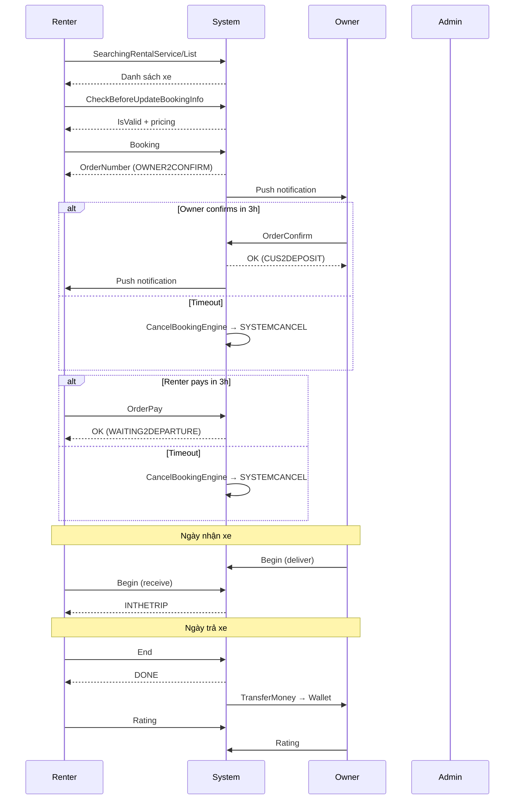

# Luồng nghiệp vụ: Đặt xe

## Tổng quan

Mô tả luồng đầy đủ từ khi người thuê tìm xe đến khi nhận xe thành công.

---

## Sơ đồ luồng

```
[Người thuê]                    [Hệ thống]                    [Chủ xe]
     │                               │                              │
     │── Tìm kiếm xe ───────────────►│ SearchingRentalService/List  │
     │◄─ Danh sách xe ───────────────│                              │
     │                               │                              │
     │── Xem chi tiết ──────────────►│ SearchingRentalService/Detail│
     │◄─ Thông tin xe ───────────────│                              │
     │                               │                              │
     │── CheckBeforeUpdateBooking ──►│ Kiểm tra điều kiện           │
     │── UpdateBookingInfo ─────────►│ Lưu thông tin đặt            │
     │                               │                              │
     │── Booking ──────────────────►│ Tạo đơn hàng                │
     │◄─ OrderId ────────────────────│                              │
     │                               │──── Push notification ──────►│
     │                               │                              │
     │                               │◄─── OrderConfirm ───────────│
     │◄─ Thông báo xác nhận ─────────│                              │
     │                               │                              │
     │── OrderPay ─────────────────►│ Thanh toán                   │
     │◄─ Xác nhận thanh toán ────────│                              │
     │                               │                              │
  [Ngày nhận xe]                     │                              │
     │── Begin (Renter) ────────────►│                              │
     │                               │──── Begin (Owner) ──────────►│
     │◄─ Chuyến đi bắt đầu ──────────│                              │
     │                               │                              │
  [Ngày trả xe]                      │                              │
     │── End ──────────────────────►│ Kết thúc chuyến              │
     │◄─ Hoàn thành ─────────────────│──── Thanh toán cho chủ xe ──►│
     │                               │                              │
     │── Rating ───────────────────►│ Đánh giá chuyến đi           │
```

---

## Chi tiết từng bước

### Bước 1: Tìm kiếm xe
- API: `POST /api/v1/SearchingRentalService/List`
- Input: Ngày thuê, địa điểm, loại xe
- **Lưu ý hiệu năng:** avg 1,781ms — bottleneck cần tối ưu

### Bước 2: Kiểm tra & cập nhật booking
- `POST /api/v1/SearchingRentalService/CheckBeforeUpdateBookingInfo`
- `POST /api/v1/SearchingRentalService/UpdateBookingInfo`
- Kiểm tra: xe còn trống, giá đúng, user đủ điều kiện

### Bước 3: Đặt xe
- API: `POST /api/v1/RentalService/Booking`
- Tạo `Order` với status = `OWNER2CONFIRM`
- Gửi notification cho chủ xe
- `Owner2ConfirmEndTime` được set = now + `HourOwner2Confirm` (mặc định 3 giờ, business hours)
- `IPAddress` tự động lấy từ request

### Bước 4: Chủ xe xác nhận
- API: `POST /api/v1/RentalService/OrderConfirm`
- Order status → `CUS2DEPOSIT`
- `Customer2DepositEndTime` được set = now + `HourCustomer2Deposit` (mặc định 3 giờ, business hours)
- **Lưu ý:** avg 8,829ms — cần điều tra
- Nếu owner không confirm trước `Owner2ConfirmEndTime` → hệ thống auto cancel (`SYSTEMCANCEL`)

### Bước 5: Thanh toán (Đặt cọc)
- API: `POST /api/v1/RentalService/OrderPay`
- Hỗ trợ: Ví điện tử, MB Bank, VietQR
- `Order_Payment` được tạo, `DepositDoneAt` được set
- Order status → `WAITING2CONFIRMDEPOSIT` → `WAITING2DEPARTURE`
- Nếu renter không cọc trước `Customer2DepositEndTime` → hệ thống auto cancel (`SYSTEMCANCEL`)

### Bước 6: Nhận xe (Begin)
- API: `POST /api/v1/Order_ListView_RentCar/Begin`
- **Cả Owner và Renter** đều cần xác nhận (2-sided):
  - Owner: set `DeliverVehicleByUsername` + `DeliverVehicleTime`
  - Renter: set `ReceiveVehicleByUsername` + `ReceiveVehicleTime`
- Khi cả 2 đã confirm → Order status → `INTHETRIP`
- Upload ảnh xe trước khi nhận (tuỳ cấu hình)

### Bước 7: Trả xe (End)
- API: `POST /api/v1/Order_ListView_RentCar/End`
- Upload ảnh xe sau khi trả
- Tính phí phát sinh (nếu có)
- Chuyển tiền cho chủ xe qua MB Bank
- Order status → `DONE`
- Nếu không có action sau `ToDate + 60 phút` → `AutoCompleteOrderEngine` tự hoàn thành

### Bước 8: Đánh giá
- API: `POST /api/v1/Order_Rating/Submit`
- Cả hai bên đánh giá lẫn nhau
- Chỉ được đánh giá khi status = `DONE`

---

## Trạng thái đơn hàng

```
OWNER2CONFIRM ─► CUS2DEPOSIT ─► WAITING2CONFIRMDEPOSIT ─► WAITING2DEPARTURE ─► INTHETRIP ─► DONE
      │                │                  │                       │                  │
      ├─ OWNERCANCEL   ├─ CUSCANCEL      ├─ CUSCANCEL           ├─ CUSCANCEL       └─ DONE (auto)
      ├─ CUSCANCEL     ├─ SYSTEMCANCEL   └─ OWNERCANCEL         └─ OWNERCANCEL
      └─ SYSTEMCANCEL
```

| Status Code | Tên hiển thị | Mô tả | Timeout |
|-------------|-------------|-------|---------|
| `OWNER2CONFIRM` | Đợi chủ dịch vụ xác nhận | Vừa tạo, chờ owner confirm | 3 giờ (business hours) |
| `CUS2DEPOSIT` | Chờ đặt cọc | Owner đã confirm, chờ renter cọc | 3 giờ (business hours) |
| `WAITING2CONFIRMDEPOSIT` | Chờ xác nhận cọc | Renter đã chuyển cọc | — |
| `WAITING2DEPARTURE` | Chờ khởi hành | Đã thanh toán, chờ ngày nhận xe | — |
| `INTHETRIP` | Đang trong chuyến | Đã nhận xe | Auto-complete sau 60 phút |
| `DONE` | Hoàn thành | Đã trả xe | — |
| `CUSCANCEL` | Khách hàng hủy chuyến | Renter huỷ | — |
| `OWNERCANCEL` | Người cho thuê hủy | Owner huỷ | — |
| `SYSTEMCANCEL` | Hệ thống hủy chuyến | Timeout auto cancel | — |

---

## Business Rules — Booking

| Rule | Mô tả |
|------|-------|
| BR-BOOK-001 | `FromDate` và `ToDate` bắt buộc, không được null |
| BR-BOOK-002 | `FromDate` < `ToDate` (không được bằng, không được lớn hơn) |
| BR-BOOK-003 | `FromDate` và `ToDate` không được là ngày quá khứ |
| BR-BOOK-004 | Xe phải ở trạng thái `IsApproved = true`, không bị `IsSuspended`, `IsDeactive`, `IsAddNew` |
| BR-BOOK-005 | Ngày thuê không được trùng `ServiceItem_BookedRentalSchedule` (đã có booking khác) |
| BR-BOOK-006 | Ngày thuê không được trùng `ServiceItem_DateBusyRentalSchedule` (owner đánh dấu bận) |
| BR-BOOK-007 | Ngày thuê không được trùng `ServiceItem_WeekdaysBusyRentalSchedule` (thứ bận hàng tuần) |
| BR-BOOK-008 | Số ngày thuê >= `ServiceItem_MinimumRentalDayRequired` (tuỳ ngày, mặc định 1 ngày) |
| BR-BOOK-009 | User phải đăng nhập |
| BR-BOOK-010 | User không được thuê xe của chính mình (Renter ID ≠ Owner ID) |
| BR-BOOK-011 | Khoảng cách giao xe không vượt quá `maximumDeliveryMileage` |
| BR-BOOK-012 | Phải gọi `UpdateBookingInfo` thành công trước khi `Booking` |
| BR-BOOK-013 | Owner có 3 giờ (business hours 7:00-21:00) để confirm, nếu không → SYSTEMCANCEL |
| BR-BOOK-014 | Renter có 3 giờ (business hours 7:00-21:00) để đặt cọc, nếu không → SYSTEMCANCEL |
| BR-BOOK-015 | Begin cần cả Owner và Renter confirm (2-sided handshake) |
| BR-BOOK-016 | Chỉ được Review khi status = DONE |
| BR-BOOK-017 | Auto-complete: đơn quá hạn trả xe 60 phút mà không có action → tự DONE |

---

## Xử lý huỷ

Xem chi tiết: [cancel-flow.md](./cancel-flow.md)

---

## QC Test Checkpoints

| # | Checkpoint (sau bước) | DB Assertions | API Response Assertions | Side Effects |
|---|----------------------|---------------|------------------------|-------------|
| 1 | Tìm kiếm xe | — | Status=1, RentalServices[].length≥0, mỗi xe có RentalPrice>0 | — |
| 2 | CheckBeforeUpdateBookingInfo | — | IsValid=true/false, InvalidCode rõ ràng nếu fail | — |
| 3 | Booking | Order created: StatusCode=`OWNER2CONFIRM`, Owner2ConfirmEndTime set, IPAddress captured | Status=1, OrderNumber returned | ServiceItem_BookedRentalSchedule.IsBooked=true; Notification gửi cho Owner; DiscountCode_Summary.UsedCount++ (nếu có voucher) |
| 4 | Owner Confirm | Order.StatusCode=`CUS2DEPOSIT`, Customer2DepositEndTime set | Status=1 | Notification gửi cho Renter |
| 5 | Renter Pay (Đặt cọc) | Order.StatusCode=`WAITING2DEPARTURE`, DepositDoneAt set, Order_Payment created | Status=1 | Wallet balance giảm (nếu pay qua ví) |
| 6 | Begin (2-sided) | DeliverVehicleByUsername + ReceiveVehicleByUsername set, StatusCode=`INTHETRIP` khi cả 2 confirmed | Status=1 | Notification cho cả 2 bên |
| 7 | End | Order.StatusCode=`DONE`, EndDate set | Status=1 | TransferMoneyEngine triggered → OwnerRemainAmount vào ví owner; Order_Finance populated |
| 8 | Rating | Order_Rating created, score>0 | Status=1 | RentalServiceItem_Calculating.Rating updated; User_Calculating updated |

## Mermaid Diagram



## Regression Watchlist

| # | Scenario | Mô tả | Cần verify |
|---|----------|-------|-----------|
| 1 | Business hours across midnight | Đặt xe lúc 20:30, Owner confirm timeout = 3h → deadline sang ngày hôm sau 10:30 (7+3h) | GetEndTime() phải wrap qua ngày mới |
| 2 | Timezone boundary | Client ở timezone khác VN (+7) → FromDate/ToDate chuyển UTC đúng | UI_TimezoneOffset applied correctly |
| 3 | Concurrent booking | 2 renter đặt cùng xe, cùng ngày → chỉ 1 thành công | ServiceItem_BookedRentalSchedule overlap check |
| 4 | Voucher + Multiday discount | Cả 2 discount áp dụng cùng lúc → TotalPrice đúng | Order SubTotal không âm |
| 5 | Auto-complete race condition | Owner End + AutoCompleteEngine chạy cùng lúc | Chỉ 1 End() thực thi, không double transfer |

---

*API liên quan: [rental-service.md](../03_API/rental-service.md) | [order.md](../03_API/order.md)*
