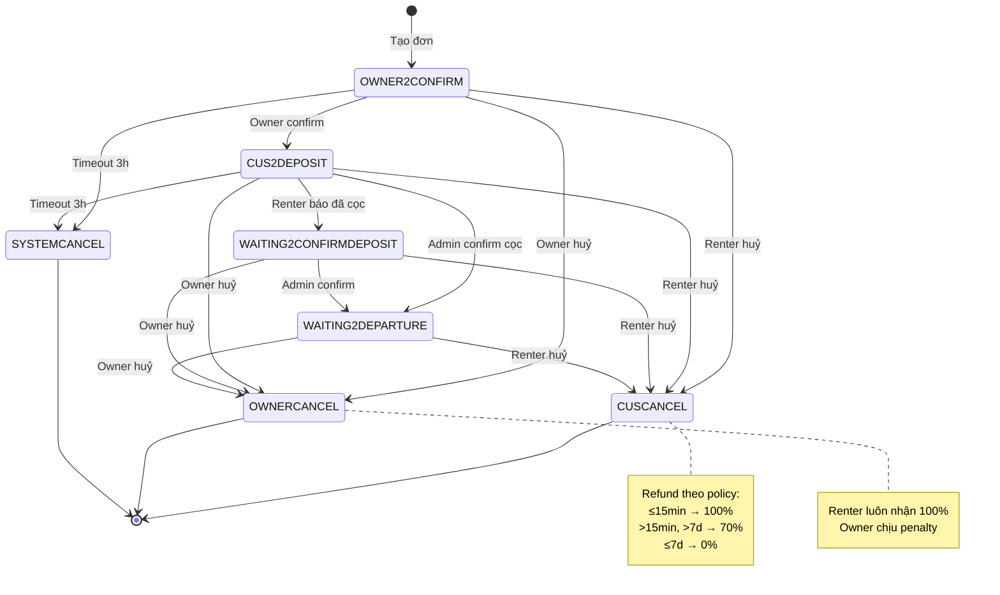

# Luồng nghiệp vụ: Huỷ đơn

## Mục lục
- [Renter Cancel](#renter-cancel)
- [Owner Cancel](#owner-cancel)
- [System Cancel (Timeout)](#system-cancel-timeout)
- [Chính sách hoàn tiền](#chính-sách-hoàn-tiền)
- [Side Effects khi huỷ đơn](#side-effects-khi-huỷ-đơn)
- [Auto Complete](#auto-complete)
- [Business Rules](#business-rules)

---

## Renter Cancel

Người thuê huỷ đơn:

```
[Người thuê]
     │
     │── GetCancelOrderInfo ──────────►│ Lấy thông tin chính sách huỷ
     │◄─ Hiển thị phí huỷ, hoàn tiền ─│
     │                                 │
     │── RenterCancel ────────────────►│
     │                                 │ Validate: status ∈ [OWNER2CONFIRM, CUS2DEPOSIT,
     │                                 │           WAITING2CONFIRMDEPOSIT, WAITING2DEPARTURE]
     │                                 │ Validate: CancelReasonId bắt buộc
     │                                 │ Tính phí phạt (CalcRerturnDepositAmount)
     │                                 │ Hoàn tiền vào ví (nếu đã cọc)
     │                                 │ Giải phóng lịch booking
     │                                 │ Hoàn lại discount code (nếu có)
     │                                 │ Thông báo cho chủ xe
     │◄─ Xác nhận huỷ ────────────────│
```

**API:** `POST /api/v1/Order_ListView_RentCar/RenterCancel`

**Hiệu năng:** avg **3,949ms** 🔴

**Điều kiện được huỷ:**
- Status phải thuộc: `OWNER2CONFIRM`, `CUS2DEPOSIT`, `WAITING2CONFIRMDEPOSIT`, `WAITING2DEPARTURE`
- User phải có permission: `Booking_Rental_Service_Renter_Can_Cancel_Permission`
- Phải chọn `CancelReasonId` (bắt buộc)
- Nếu `CancelReasonCode == "another_reason"` → phải nhập `CancelReasonDetail`

**Kết quả:** Status → `CUSCANCEL`

---

## Owner Cancel

Chủ xe huỷ đơn:

```
[Chủ xe]
     │
     │── GetCancelOrderInfo ──────────►│ Lấy thông tin chi phí huỷ
     │◄─ Hiển thị penalty ────────────│
     │                                 │
     │── OwnerCancel ─────────────────►│
     │                                 │ Validate: status ∈ [OWNER2CONFIRM, CUS2DEPOSIT,
     │                                 │           WAITING2CONFIRMDEPOSIT, WAITING2DEPARTURE]
     │                                 │ Validate: CancelReasonId bắt buộc
     │                                 │ Hoàn 100% tiền cọc cho người thuê
     │                                 │ Tính penalty cho chủ xe (ownerReceive < 0)
     │                                 │ Ghi nhận IsOwnerFault → tính cancel ratio
     │                                 │ Đánh dấu ngày bận (DateBusyRentalSchedule)
     │                                 │ Auto tạo QuickOrder cho renter tìm xe mới
     │                                 │ Thông báo cho người thuê
     │◄─ Xác nhận huỷ ────────────────│
```

**API:** `POST /api/v1/Order_ListView_RentCar/OwnerCancel`

**Hiệu năng:** 89 lượt/30 ngày | avg **8,988ms** 🔴 | max 31,853ms

**Điều kiện được huỷ:**
- Status phải thuộc: `OWNER2CONFIRM`, `CUS2DEPOSIT`, `WAITING2CONFIRMDEPOSIT`, `WAITING2DEPARTURE`
- User phải có permission: `Booking_Rental_Service_Owner_Can_Cancel_Permission`
- Phải chọn `CancelReasonId` (bắt buộc)
- Nếu `CancelReasonCode == "another_reason"` → phải nhập `CancelReasonDetail`

**Penalty cho chủ xe:**
- Owner luôn bị tính penalty khi huỷ (ownerReceive là số âm)
- Cancel ratio được tính bởi `CalcCancelOrderRatioJob` mỗi 7 ngày: `CancelOrderCount / TotalOrderCount * 100%`
- Chỉ tính đơn huỷ có `IsOwnerFault = true` trong 7 ngày gần nhất
- Hệ thống tự động đánh dấu ngày xe bận (tránh bị đặt lại cùng khoảng thời gian)

**Kết quả:** Status → `OWNERCANCEL`

---

## System Cancel (Timeout)

Hệ thống tự động huỷ khi quá thời gian chờ:

```
[AutoCancelOverTimeOrderEngine]
     │
     │── Check Owner2ConfirmEndTime ──► Nếu quá hạn → SYSTEMCANCEL
     │── Check Customer2DepositEndTime ──► Nếu quá hạn → SYSTEMCANCEL
```

**Timeout mặc định:**
- `HourOwner2Confirm` = **3 giờ** (chỉ tính trong business hours: 7:00 - 21:00)
- `HourCustomer2Deposit` = **3 giờ** (chỉ tính trong business hours: 7:00 - 21:00)

**Thuật toán GetEndTime:**
1. Nếu giờ hiện tại < BusinessHourStart → bắt đầu tính từ BusinessHourStart
2. Cộng thêm số giờ timeout
3. Nếu kết quả > BusinessHourEnd → dời sang ngày tiếp theo
4. Convert về timezone client

**Notification templates:**
- `RENT_CAR_SYSTEM_CANCEL_OWNER_CONFIRM_TIMEOUT_NOTIFY_TO_USER` — thông báo renter khi owner không confirm kịp
- `RENT_CAR_SYSTEM_CANCEL_DEPOSIT_TIMEOUT_NOTIFY_TO_USER` — thông báo renter khi hết hạn cọc

**Kết quả:** Status → `SYSTEMCANCEL`

---

## Chính sách hoàn tiền

### Tham số cấu hình (từ CancelOrderSettingModel)

| Tham số | Mô tả | Mặc định | Source |
|---------|-------|----------|--------|
| `FullRefundWithinMinutes` | Thời gian (phút) được hoàn 100% sau khi cọc xong | **15 phút** | `CancelOrderSetting` trong `RENTAL_SERVICE_SETTING` |
| `NoRefundGreaterThanDays` | Số ngày trước chuyến — nếu huỷ trong khoảng này, không hoàn | **7 ngày** | `CancelOrderSetting` trong `RENTAL_SERVICE_SETTING` |
| `PenaltyDepositPercent` | % phạt trên tiền cọc khi huỷ | **30%** | `Vehicle_RentalSetting` → `RentalServiceCategorySettingJsonModel` |
| `CompletionFeePercentage` | % phí dịch vụ (platform commission) | Theo priority: service item → owner → category → system | `ConfigCompletionFee` |
| `DepositPercent` | % cọc trên tổng tiền thuê | **30%** | `Vehicle_RentalSetting` → `RentalServiceCategorySettingJsonModel` |

### Biến tính toán chi tiết

```
depositPercent   = (DepositPercent ?? 30) / 100        // 0.3
penaltyPercent   = (PenaltyDepositPercent ?? 30) / 100 // 0.3
refundPercent    = 1 - penaltyPercent                  // 0.7
servicePercent   = CompletionFeePercentage / 100       // e.g., 0.2
renterPercent    = penaltyPercent - servicePercent      // e.g., 0.1

// Thời gian tính toán:
diffDeposit      = (DateTime.UtcNow - DepositDoneAt).TotalMinutes
diffRental       = (Order.FromDate - DateTime.UtcNow).TotalDays
```

> **Chi tiết formulas tính tiền:** Xem [pricing-calculation.md](./pricing-calculation.md#14-deposit--refund--hoàn-tiền-khi-huỷ)

### Bảng chính sách hoàn tiền (CalcRerturnDepositAmount)

**Kịch bản 1: Huỷ trong FullRefundWithinMinutes**

| Ai huỷ | Renter nhận | Owner nhận | Platform nhận |
|--------|-------------|------------|---------------|
| Renter | 100% tiền cọc | 0 | 0 |
| Owner | 100% tiền cọc | 0 (bị penalty) | 0 |

**Kịch bản 2: Huỷ sau FullRefundWithinMinutes, nhưng > NoRefundGreaterThanDays trước chuyến**

| Ai huỷ | Renter nhận | Owner nhận | Platform nhận |
|--------|-------------|------------|---------------|
| Renter | deposit × (1 - penaltyPercent) | deposit × (penaltyPercent - servicePercent) | Phần còn lại |
| Owner | 100% tiền cọc | -deposit × penaltyPercent (bị trừ) | deposit × servicePercent |

**Kịch bản 3: Huỷ trong NoRefundGreaterThanDays trước chuyến (sát ngày)**

| Ai huỷ | Renter nhận | Owner nhận | Platform nhận |
|--------|-------------|------------|---------------|
| Renter | **0** (không hoàn) | deposit × (1 - servicePercent) | deposit × servicePercent |
| Owner | 100% tiền cọc | -deposit (bị trừ toàn bộ) | deposit × servicePercent |

> **Lưu ý:**
> - Có 2 loại deposit: **Fixed amount** (DepositAmount > 0) hoặc **Percentage-based** (DepositAmount == 0, dùng DepositPercent × subTotal)
> - Owner cancel luôn hoàn 100% cho renter, owner chịu penalty
> - Số tiền được ghi vào `Order_Finance`: `RenterCancelRefund`, `OwnerCancelRefund`, `PlanCancelProfitAmount`

---

## Side Effects khi huỷ đơn

Khi một đơn hàng bị huỷ, hệ thống thực hiện các bước sau:

| # | Side Effect | Mô tả |
|---|------------|-------|
| 1 | **Update Order Status** | `IsCancel = true`, StatusCode → `CUSCANCEL` / `OWNERCANCEL` / `SYSTEMCANCEL` |
| 2 | **Giải phóng lịch booking** | `ServiceItem_BookedRentalSchedule.IsBooked = false` |
| 3 | **Hoàn discount code** | `Order_DiscountCode_Applied_OneTimeUse.IsCanceled = true`, giảm usage count trên `DiscountCode_Summary` |
| 4 | **Đánh dấu ngày bận** _(chỉ Owner Cancel)_ | Tạo `ServiceItem_DateBusyRentalSchedule` — tránh bị đặt lại cùng khoảng thời gian |
| 5 | **Auto tạo QuickOrder** _(chỉ Owner Cancel)_ | Nếu config `QuickOrder_RentCar_AutoCreate.Code == "owner_cancel"` → tạo QuickOrder cho renter tìm xe thay thế |
| 6 | **Tạo Payment record** | Nếu đã cọc (`DepositDoneAt != null`) → tạo `Order_Payment` cho việc hoàn tiền |
| 7 | **Cập nhật User Calculating** | Cập nhật thống kê đơn hàng theo trạng thái cho owner |
| 8 | **Gửi Notification** | Push notification cho cả 2 bên (renter + owner) |

**Notification templates:**
- `RENT_CAR_USER_CANCEL_REQUEST_NOTIFY_TO_USER` / `_TO_OWNER` — Renter huỷ
- `RENT_CAR_OWNER_CANCEL_REQUEST_NOTIFY_TO_USER` / `_TO_OWNER` — Owner huỷ
- `RENT_CAR_SUGGESTION_AFTER_OWNER_CANCEL` — Gợi ý xe mới cho renter khi owner huỷ

---

## Cancel Reasons

Entity: `ConfigVehicleRentalCancelReason`

```csharp
{
    long Id,
    string Code,
    string Name,
    bool UsedForOwner,      // Có dùng cho chủ xe?
    bool UsedForCustomer,   // Có dùng cho người thuê?
    bool IsOwnerFault,      // Có tính là lỗi chủ xe? (dùng cho penalty ratio)
    string StatusCodes2Apply,
    string MoreConfig
}
```

**Đặc biệt:** `Code == "another_reason"` → bắt buộc nhập `CancelReasonDetail` (lý do chi tiết tự viết).

---

## Auto Complete

`AutoCompleteOrderEngine` tự động hoàn thành đơn khi quá thời gian trả xe mà không có action:

**Cấu hình:**
- `CanAutoCompleteOrder`: Boolean — bật/tắt tính năng
- `AutoCompleteOrder_AfterMinutes`: Số phút sau khi hết hạn thuê (mặc định **60 phút**)

**Logic:**
1. Tìm đơn có status `INTHETRIP` đã quá `ToDate + AutoCompleteOrder_AfterMinutes`
2. Gửi notification cảnh báo cho đơn sắp hết hạn
3. Gọi `OrderService.End()` để hoàn thành tự động
4. Stored procedure: `sp_Get_OrderOverTimeButDontEnd_Json` trả 2 mảng:
   - `OrderOverTimeButDontEndInfo[]` — đơn cần cảnh báo
   - `OrderOver1HourButDontEndInfo[]` — đơn cần auto-complete

Xem: [background-engines.md](../01_ARCHITECTURE/background-engines.md)

---

## Business Rules

| Rule | Mô tả |
|------|-------|
| BR-CANCEL-001 | Renter chỉ được huỷ khi status ∈ {OWNER2CONFIRM, CUS2DEPOSIT, WAITING2CONFIRMDEPOSIT, WAITING2DEPARTURE} |
| BR-CANCEL-002 | Owner chỉ được huỷ khi status ∈ {OWNER2CONFIRM, CUS2DEPOSIT, WAITING2CONFIRMDEPOSIT, WAITING2DEPARTURE} |
| BR-CANCEL-003 | Bắt buộc chọn CancelReasonId khi huỷ |
| BR-CANCEL-004 | Nếu lý do huỷ là "another_reason" → bắt buộc nhập CancelReasonDetail |
| BR-CANCEL-005 | Huỷ trong FullRefundWithinMinutes → hoàn 100% |
| BR-CANCEL-006 | Huỷ sát ngày (trong NoRefundGreaterThanDays) → Renter không được hoàn |
| BR-CANCEL-007 | Owner huỷ → luôn hoàn 100% cho Renter, Owner chịu penalty |
| BR-CANCEL-008 | Owner huỷ → ngày bận được tự động đánh dấu (tránh đặt lại) |
| BR-CANCEL-009 | Owner huỷ → hệ thống có thể tự tạo QuickOrder cho renter |
| BR-CANCEL-010 | System timeout: Owner không confirm trong 3 giờ (business hours) → auto cancel |
| BR-CANCEL-011 | System timeout: Renter không cọc trong 3 giờ (business hours) → auto cancel |
| BR-CANCEL-012 | Auto-complete: đơn quá hạn trả xe 60 phút → tự hoàn thành |
| BR-CANCEL-013 | Cancel ratio owner = (số đơn bị huỷ lỗi owner / tổng đơn) × 100%, tính mỗi 7 ngày |

---

*API liên quan: [order.md](../03_API/order.md) | [rental-service.md](../03_API/rental-service.md)*
*Test scenarios chi tiết: [cancel-flow.test-scenarios.md](../03_API/cancel-flow.test-scenarios.md)*

---

## QC Test Checkpoints

| # | Checkpoint | Actor | DB Assertions | Side Effects cần verify |
|---|-----------|-------|---------------|------------------------|
| 1 | Renter cancel (OWNER2CONFIRM) | Renter | Order.StatusCode=`CUSCANCEL`, IsCancel=true | BookedSchedule released; No refund (chưa cọc); Notification to Owner |
| 2 | Renter cancel (WAITING2DEPARTURE, đã cọc) | Renter | Order.StatusCode=`CUSCANCEL`, Order_Finance.RenterCancelRefund populated | Refund vào ví Renter (theo policy); BookedSchedule released; Discount restored |
| 3 | Owner cancel (OWNER2CONFIRM) | Owner | Order.StatusCode=`OWNERCANCEL`, IsOwnerFault set | Cancel ratio affected; Notification to Renter |
| 4 | Owner cancel (WAITING2DEPARTURE, đã cọc) | Owner | Order.StatusCode=`OWNERCANCEL`, Order_Finance populated | 100% refund to Renter; DateBusySchedule created; QuickOrder created (if config); Owner wallet debited |
| 5 | System cancel (owner timeout) | System | Order.StatusCode=`SYSTEMCANCEL`, IsCancel=true | BookedSchedule released; Discount restored; Notification to both |
| 6 | System cancel (deposit timeout) | System | Order.StatusCode=`SYSTEMCANCEL` | BookedSchedule released; Discount restored; Notification to both |

## Mermaid Diagram



## Regression Watchlist

| # | Scenario | Mô tả | Risk |
|---|----------|-------|------|
| 1 | Refund rounding | CalcRerturnDepositAmount tính % → decimal rounding → tổng 3 bên phải = DepositAmount | Off-by-one VND |
| 2 | FullRefundWithinMinutes boundary | Cancel chính xác tại phút 15 (edge: diffDeposit == FullRefundWithinMinutes) | `<=` vs `<` comparison |
| 3 | Discount restore trùng lặp | Cancel 2 lần (race condition) → DiscountCode_Summary.UsedCount giảm 2 lần | Idempotency check |
| 4 | Owner cancel không có deposit | Owner cancel ở OWNER2CONFIRM → không có refund calculation | Null check trên DepositDoneAt |
| 5 | Business hours wrap | Cancel engine chạy lúc 22:00 VN → đơn có deadline 21:00 → phải cancel | GetEndTime boundary |
