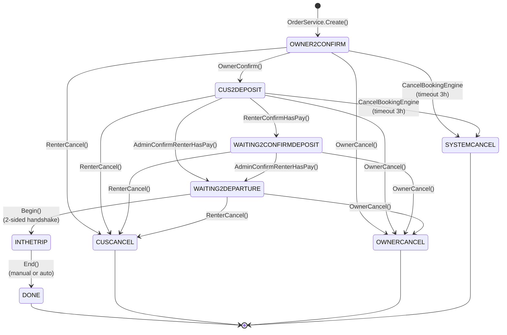

# Order Status Machine

> **Source:** `OrderConstant.cs`, `OrderService_UserAction.cs`, `OrderBaseService_AdminConfirm.cs`, `CancelBookingEngine`

---

## Tất cả trạng thái (9 status codes)

| Code | Tên hiển thị | Loại | Mô tả |
|------|-------------|------|-------|
| `OWNER2CONFIRM` | Chờ xác nhận | Active | Chờ chủ xe xác nhận đơn đặt |
| `CUS2DEPOSIT` | Chờ đặt cọc | Active | Chờ khách thanh toán tiền cọc |
| `WAITING2CONFIRMDEPOSIT` | Chờ xác nhận cọc | Active | Khách đã báo thanh toán, chờ admin xác nhận |
| `WAITING2DEPARTURE` | Chờ giao xe | Active | Cọc đã xác nhận, chờ đến ngày giao xe |
| `INTHETRIP` | Đang trong chuyến | Active | Xe đã được giao, chuyến đang diễn ra |
| `DONE` | Hoàn tất | Terminal | Chuyến kết thúc thành công |
| `OWNERCANCEL` | Chủ xe huỷ | Terminal | Chủ xe huỷ đơn |
| `CUSCANCEL` | Khách huỷ | Terminal | Khách thuê huỷ đơn |
| `SYSTEMCANCEL` | Hệ thống huỷ | Terminal | Hệ thống tự động huỷ do hết hạn |

---

## State machine diagram

```
                         ┌─────────────┐
                         │  TẠO ĐƠN    │
                         └──────┬──────┘
                                │
                                ▼
                   ┌────────────────────────┐
                   │    OWNER2CONFIRM       │
                   │  Chờ chủ xe xác nhận   │
                   │  Timeout: HourOwner2   │
                   │         Confirm        │
                   └─────┬──────┬───────┬───┘
                         │      │       │
              Owner      │      │       │  Timeout /
              confirms   │      │       │  Owner cancels
                         │      │       │
                         ▼      │       ▼
          ┌──────────────────┐  │  ┌──────────────┐
          │   CUS2DEPOSIT    │  │  │ SYSTEMCANCEL  │
          │ Chờ khách đặt cọc│  │  │ hoặc          │
          │ Timeout: HourCus │  │  │ OWNERCANCEL   │
          │    2Deposit      │  │  └──────────────┘
          └──┬───────┬───┬───┘  │
             │       │   │      │
   Renter    │       │   │      │  Timeout
   confirms  │       │   │      │
   payment   │       │   │      │
             ▼       │   │      │
┌────────────────────┐   │      │
│WAITING2CONFIRMDEPO │   │      │
│SIT                 │   │      │
│Chờ admin xác nhận  │   │      │
└─────┬──────────┬───┘   │      │
      │          │       │      │
Admin │    Cancel│       │Cancel│
confirms       │       │      │
      │          ▼       ▼      │
      │     ┌──────────────┐    │
      │     │  CUSCANCEL   │    │
      │     │  hoặc        │    │
      │     │  OWNERCANCEL │    │
      │     └──────────────┘    │
      ▼                         │
┌────────────────────┐          │
│ WAITING2DEPARTURE  │          │
│ Chờ giao xe        │◄─────── │ (AdminConfirm
│                    │           từ CUS2DEPOSIT)
└─────┬──────────┬───┘
      │          │
 Begin│    Cancel│
      │          │
      │          ▼
      │   ┌──────────────┐
      │   │  CUSCANCEL   │
      │   │  hoặc        │
      │   │  OWNERCANCEL │
      │   └──────────────┘
      ▼
┌────────────────────┐
│    INTHETRIP       │
│  Đang trong chuyến │
│  Auto-complete:    │
│  60 phút sau ToDate│
└─────────┬──────────┘
          │
     End  │ (manual hoặc auto)
          │
          ▼
┌────────────────────┐
│       DONE         │
│    Hoàn tất ✓      │
└────────────────────┘
```

---

## Chi tiết chuyển trạng thái

### Bảng transitions

| From | To | Trigger | Actor | Method |
|------|----|---------|-------|--------|
| *(new)* | `OWNER2CONFIRM` | Tạo đơn | Renter | `OrderService.Create()` |
| `OWNER2CONFIRM` | `CUS2DEPOSIT` | Xác nhận | Owner | `OwnerConfirm()` |
| `OWNER2CONFIRM` | `OWNERCANCEL` | Huỷ đơn | Owner | `OwnerCancel()` |
| `OWNER2CONFIRM` | `SYSTEMCANCEL` | Hết hạn confirm | System | `CancelBookingEngine` |
| `CUS2DEPOSIT` | `WAITING2CONFIRMDEPOSIT` | Báo đã thanh toán | Renter | `RenterConfirmHasPay()` |
| `CUS2DEPOSIT` | `WAITING2DEPARTURE` | Admin xác nhận cọc | Admin | `AdminConfirmRenterHasPay()` |
| `CUS2DEPOSIT` | `CUSCANCEL` | Huỷ đơn | Renter | `RenterCancel()` |
| `CUS2DEPOSIT` | `OWNERCANCEL` | Huỷ đơn | Owner | `OwnerCancel()` |
| `CUS2DEPOSIT` | `SYSTEMCANCEL` | Hết hạn deposit | System | `CancelBookingEngine` |
| `WAITING2CONFIRMDEPOSIT` | `WAITING2DEPARTURE` | Xác nhận cọc | Admin | `AdminConfirmRenterHasPay()` |
| `WAITING2CONFIRMDEPOSIT` | `CUSCANCEL` | Huỷ đơn | Renter | `RenterCancel()` |
| `WAITING2CONFIRMDEPOSIT` | `OWNERCANCEL` | Huỷ đơn | Owner | `OwnerCancel()` |
| `WAITING2DEPARTURE` | `INTHETRIP` | Giao xe | Owner+Renter | `Begin()` |
| `WAITING2DEPARTURE` | `CUSCANCEL` | Huỷ đơn | Renter | `RenterCancel()` |
| `WAITING2DEPARTURE` | `OWNERCANCEL` | Huỷ đơn | Owner | `OwnerCancel()` |
| `INTHETRIP` | `DONE` | Kết thúc chuyến | Owner/Renter | `End()` |
| `INTHETRIP` | `DONE` | Auto-complete | System | `AutoCompleteOrderEngine` |

### Trạng thái có thể cancel

```
Cancelable = { OWNER2CONFIRM, CUS2DEPOSIT, WAITING2CONFIRMDEPOSIT, WAITING2DEPARTURE }
```

**INTHETRIP** và **DONE** không thể cancel — chuyến đã bắt đầu hoặc đã xong.

---

## Timeout & Deadline

### Cách tính deadline

```csharp
// Tính từ RentalServiceCategorySettingJsonModel
Owner2ConfirmEndTime = GetEndTime(now, HourOwner2Confirm, BusinessHourStart, BusinessHourEnd)
Customer2DepositEndTime = GetEndTime(now, HourCustomer2Deposit, BusinessHourStart, BusinessHourEnd)
```

`GetEndTime()` tính deadline trong khung giờ làm việc:
- **BusinessHourStart:** 7:00 (default)
- **BusinessHourEnd:** 21:00 (default)
- Nếu hết giờ làm việc → cộng thêm vào ngày hôm sau

### Timeout auto-cancel (CancelBookingEngine)

```
Mỗi cycle, engine kiểm tra:
1. Orders WHERE StatusCode = 'OWNER2CONFIRM' AND Owner2ConfirmEndTime < now
   → Chuyển sang SYSTEMCANCEL

2. Orders WHERE StatusCode = 'CUS2DEPOSIT' AND Customer2DepositEndTime < now
   → Chuyển sang SYSTEMCANCEL

Side effects khi SYSTEMCANCEL:
- Release lịch xe (ServiceItem_BookedRentalSchedule.IsBooked = false)
- Restore mã giảm giá nếu đã áp dụng
- Gửi notification cho cả Owner và Renter
```

### Auto-complete (AutoCompleteOrderEngine)

```
Kiểm tra orders WHERE StatusCode = 'INTHETRIP':

1. Cảnh báo: ToDate - now <= 0 (hết hạn nhưng chưa quá 60 phút)
   → Gửi notification nhắc Owner + Renter kết thúc chuyến

2. Auto-complete: ToDate + 60 phút < now
   → Tự động gọi OrderService.End()
   → Trigger TransferMoney flow
   → Gửi completion notification

Config: CanAutoCompleteOrder, AutoCompleteOrder_AfterMinutes (default 60)
```

---

## Timestamps quan trọng trên Order

| Field | Set khi | Mô tả |
|-------|---------|-------|
| `Owner2ConfirmEndTime` | Tạo đơn | Deadline cho Owner xác nhận |
| `Customer2DepositEndTime` | `OWNER2CONFIRM` → `CUS2DEPOSIT` | Deadline cho Renter đặt cọc |
| `DepositDoneAt` | `AdminConfirmRenterHasPay` | Thời điểm xác nhận cọc |
| `FromDate` | Tạo đơn | Ngày bắt đầu thuê |
| `ToDate` | Tạo đơn | Ngày kết thúc thuê |
| `BeginDate` | `Begin()` | Thời điểm thực tế giao xe |
| `EndDate` | `End()` | Thời điểm thực tế trả xe |

---

## Payment Actions (sau khi cancel/complete)

Đây không phải status transitions mà là các hành động thanh toán admin thực hiện:

| Action | Khi nào | Mô tả |
|--------|---------|-------|
| `AdminConfirmRenterHasPay` | `CUS2DEPOSIT` / `WAITING2CONFIRMDEPOSIT` | Xác nhận khách đã đặt cọc |
| `AdminConfirmPayOwner` | Sau `DONE` | Thanh toán cho chủ xe |
| `AdminConfirmRefund2Cus` | Sau `CUSCANCEL` / `OWNERCANCEL` | Hoàn tiền cho khách |
| `AdminConfirmCompensation2Owner` | Sau `CUSCANCEL` | Đền bù cho chủ xe (khách huỷ) |
| `AdminConfirmCompensation2Renter` | Sau `OWNERCANCEL` | Đền bù cho khách (chủ xe huỷ) |
| `AdminConfirmFineOwner` | Sau `OWNERCANCEL` | Phạt chủ xe huỷ đơn |
| `AdminConfirmFineRenter` | Sau `CUSCANCEL` | Phạt khách huỷ đơn |
| `AdminConfirmNotFineOwner` | Sau `OWNERCANCEL` | Miễn phạt chủ xe |
| `AdminConfirmNotFineRenter` | Sau `CUSCANCEL` | Miễn phạt khách |

---

## Chính sách cancel & hoàn tiền

### Renter Cancel

| Thời điểm huỷ | Hoàn tiền cọc | Phạt |
|----------------|---------------|------|
| Trong 15 phút sau đặt | 100% | Không |
| Sau 15 phút, trước 7 ngày | 70% (phạt 30%) | 30% tiền cọc |
| Trong 7 ngày trước ngày thuê | 0% | 100% tiền cọc |

### Owner Cancel

| Thời điểm huỷ | Hậu quả |
|----------------|---------|
| Trước khi khách đặt cọc | Không phạt trực tiếp |
| Sau khi khách đặt cọc | Hoàn 100% cọc cho khách + có thể bị phạt |
| Bất kỳ lúc nào | Tăng `OwnerCancelOrderRatio` → giảm priority hiển thị |

> Chi tiết formulas: xem [cancel-flow.md](./cancel-flow.md) và [pricing-calculation.md](./pricing-calculation.md)

---

## Order Change Status Log

Mỗi lần chuyển trạng thái được ghi lại trong entity `Order_ChangeStatus`:

```
Order_ChangeStatus {
    OrderId         // FK → Order
    FromStatusCode  // Trạng thái trước
    ToStatusCode    // Trạng thái sau
    ChangedByUserId // Ai thực hiện
    ChangedAt       // Thời điểm
    Reason          // Lý do (nếu cancel)
}
```

---

## Nhóm trạng thái cho UI

App mobile nhóm trạng thái để filter:

| Group Code | Bao gồm | Tab hiển thị |
|------------|----------|-------------|
| `ALL` | Tất cả | Tất cả |
| `PENDING` | `OWNER2CONFIRM`, `CUS2DEPOSIT`, `WAITING2CONFIRMDEPOSIT` | Chờ xử lý |
| `ACTIVE` | `WAITING2DEPARTURE`, `INTHETRIP` | Đang diễn ra |
| `COMPLETED` | `DONE` | Hoàn tất |
| `CANCELLED` | `CUSCANCEL`, `OWNERCANCEL`, `SYSTEMCANCEL` | Đã huỷ |

---

*Xem thêm: [booking-flow.md](./booking-flow.md) | [cancel-flow.md](./cancel-flow.md) | [order.md](../03_API/order.md)*

---

## Mermaid State Diagram



## QC Status Transition Verification

Bảng verification cho mỗi transition — QC cần kiểm tra các side effects sau khi status thay đổi:

| From | To | Trigger | Side Effects cần verify |
|------|----|---------|------------------------|
| *(new)* | `OWNER2CONFIRM` | Tạo đơn | Order created with Owner2ConfirmEndTime; BookedSchedule.IsBooked=true; Notification to Owner |
| `OWNER2CONFIRM` | `CUS2DEPOSIT` | Owner confirm | Customer2DepositEndTime set; Notification to Renter |
| `OWNER2CONFIRM` | `OWNERCANCEL` | Owner cancel | BookedSchedule released; Cancel ratio updated; Notification to Renter |
| `OWNER2CONFIRM` | `SYSTEMCANCEL` | Timeout | BookedSchedule released; Discount restored; Notification to both |
| `CUS2DEPOSIT` | `WAITING2CONFIRMDEPOSIT` | Renter báo đã cọc | Order_Payment record created |
| `CUS2DEPOSIT` | `WAITING2DEPARTURE` | Admin confirm cọc | DepositDoneAt set; Wallet balance deducted |
| `CUS2DEPOSIT` | `CUSCANCEL` | Renter cancel | BookedSchedule released; No refund (chưa cọc); Discount restored |
| `CUS2DEPOSIT` | `SYSTEMCANCEL` | Timeout | BookedSchedule released; Discount restored; Notification to both |
| `WAITING2CONFIRMDEPOSIT` | `WAITING2DEPARTURE` | Admin confirm | DepositDoneAt set |
| `WAITING2DEPARTURE` | `INTHETRIP` | Both Begin | DeliverVehicle + ReceiveVehicle fields set; StatusCode changes only when BOTH confirmed |
| `WAITING2DEPARTURE` | `CUSCANCEL` | Renter cancel | Refund theo policy (CalcRerturnDepositAmount); BookedSchedule released |
| `WAITING2DEPARTURE` | `OWNERCANCEL` | Owner cancel | 100% refund to Renter; DateBusySchedule created; QuickOrder created |
| `INTHETRIP` | `DONE` | End (manual) | EndDate set; TransferMoneyEngine → owner wallet funded; Order_Finance populated |
| `INTHETRIP` | `DONE` | Auto-complete (60min) | IsSystemAutoDone=true; Same financial processing as manual End |
